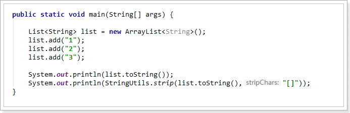

# **1.Continue 和 Break**


# **2.List转成string,去掉两边的中括号**

```java
StringUtils.strip(partnerApplyDetail1.getList().toString().toString(),"[]");
```




# 3.**Long类型的比较**

```java
public static void main(String[] args) {
    Long long1 = new Long(120);
    Long long2 = new Long(120);
    System.out.println(long1 == long2);  //false

    long long3 = 120;
    long long4 = 120;
    System.out.println(long3 == long4);  //true
}
```

