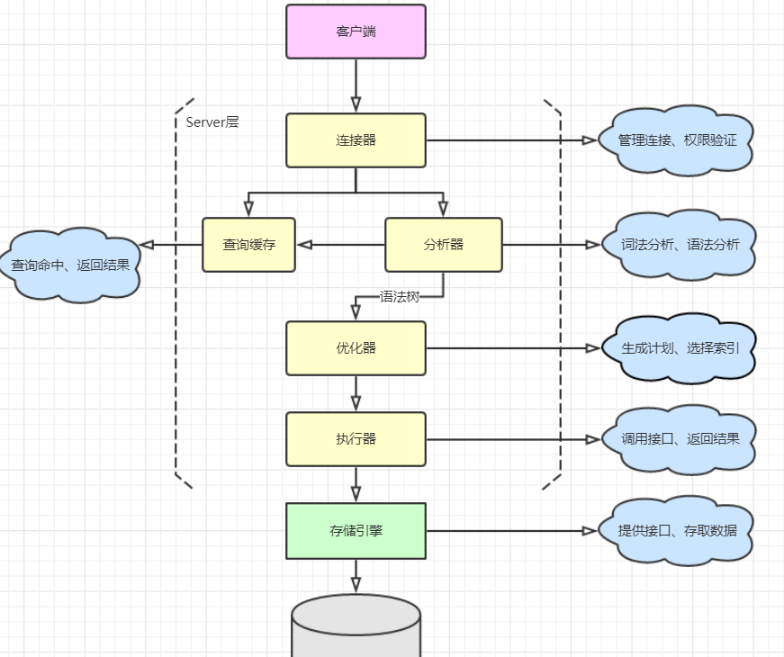
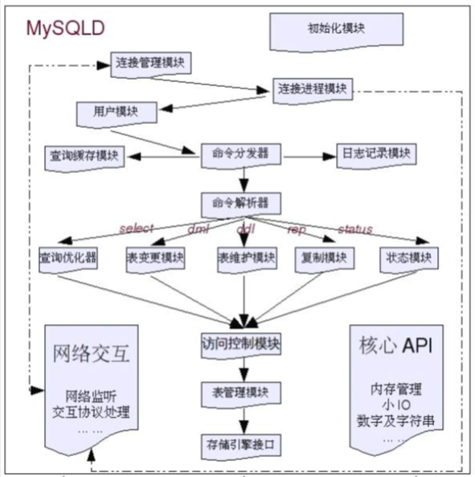
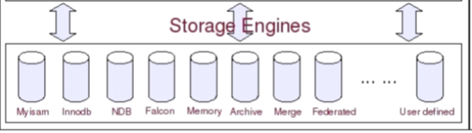
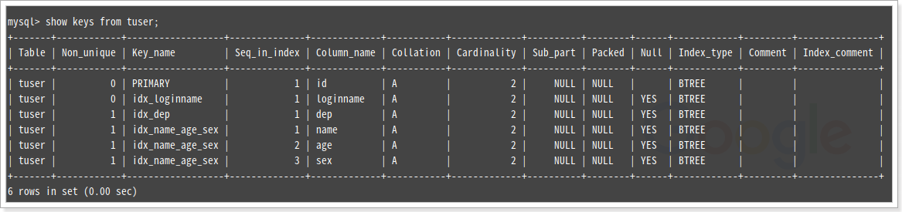

[toc]

# 1.mysql基本命令

展示

```sql
可以使用`;`,`\g`,(水平展示)`\G`(垂直展示)
```

插入数据:

```sql
INSERT INTO student VALUES(1,'eric',20,'广州人','男');
```

修改数据:  

```sql
UPDATE student SET gender='女' WHERE id=2;
```

删除数据

```sql
 DELETE FROM student WHERE id=3;
```

去重复

```sql
SELECT DISTINCT 字段名 FROM student;
```

group by

```sql
select count(a),c from test group by c
```

左链接

```sql
select * from test1 a left join test2 b on a.id=b.id
```

切换成指定库名

```sql
use company(库名);
```

查看现在正在连接的库名

```sql
select  database();
```

查看所有的,我有权访问的的库名

```sql
show databases;
```

设置隔离级别(8.0版本)

```sql
// 设置隔离级别,当前session
mysql> set session transaction isolation level read uncommitted;
// 设置隔离级别,全局
mysql> SET global  transaction isolation level read uncommitted;
// 查询隔离级别
mysql> select @@global.transaction_isolation,@@transaction_isolation;
```


# 2.索引

# 3.锁

# 4.事务

# 5.日志

# 6.mysql安装
## 1. 下载 mysql 源安装包

```shell
$ curl -LO http://dev.mysql.com/get/mysql57-community-release-el7-11.noarch.rpm
```

## 2. 安装 mysql 源

```shell
$ sudo yum localinstall mysql57-community-release-el7-11.noarch.rpm
```

## 3. 检查 yum 源是否安装成功

```shell
$ sudo yum repolist enabled | grep "mysql.*-community.*"
mysql-connectors-community           MySQL Connectors Community              21
mysql-tools-community                MySQL Tools Community                   38
mysql57-community                    MySQL 5.7 Community Server             130
```

## 4. 安装

```shell
$ sudo yum install mysql-community-server
```

## 5. 启动安装服务

```shell
$ sudo systemctl enable mysqld
```

##  6. 启动服务

```shell
$ sudo systemctl start mysqld
```

##  7. 查看服务状态

```shell
$ sudo systemctl status mysqld
```

## 8. 修改 root 默认密码

MySQL 5.7 启动后，在 /var/log/mysqld.log 文件中给 root 生成了一个默认密码。通过下面的方式找到 root 默认密码，然后登录 mysql 进行修改：
```shell
$ grep 'temporary password' /var/log/mysqld.log
[Note] A temporary password is generated for root@localhost: **********
```

## 8. 登录 MySQL 并修改密码

```shell
$ mysql -u root -p
Enter password: 
mysql> ALTER USER 'root'@'localhost' IDENTIFIED BY 'MyNewPass4!';
```

注意：MySQL 5.7 默认安装了密码安全检查插件（validate_password），默认密码检查策略要求密码必须包含：大小写字母、数字和特殊符号，并且长度不能少于 8 位。

通过 MySQL 环境变量可以查看密码策略的相关信息：

```shell
mysql> SHOW VARIABLES LIKE 'validate_password%';
+--------------------------------------+--------+
| Variable_name                        | Value  |
+--------------------------------------+--------+
| validate_password_check_user_name    | OFF    |
| validate_password_dictionary_file    |        |
| validate_password_length             | 8      |
| validate_password_mixed_case_count   | 1      |
| validate_password_number_count       | 1      |
| validate_password_policy             | MEDIUM |
| validate_password_special_char_count | 1      |
+--------------------------------------+--------+
7 rows in set (0.01 sec)
```

## 9. 指定密码校验策略

```shell
$ sudo vi /etc/my.cnf

[mysqld]
# 添加如下键值对, 0=LOW, 1=MEDIUM, 2=STRONG
validate_password_policy=0
```

## 10. 禁用密码策略

```shell
$ sudo vi /etc/my.cnf
	
[mysqld]
# 禁用密码校验策略
validate_password = off
```

## 11. 重启 MySQL 服务，使配置生效

```shell
$ sudo systemctl restart mysqld
```

## 12. 添加远程登录用户

MySQL 默认只允许 root 帐户在本地登录，如果要在其它机器上连接 MySQL，必须修改 root 允许远程连接，或者添加一个允许远程连接的帐户，为了安全起见，本例添加一个新的帐户：

```shell
mysql> GRANT ALL PRIVILEGES ON *.* TO 'admin'@'%' IDENTIFIED BY 'secret' WITH GRANT OPTION;
```

## 13. 配置默认编码为 utf8

MySQL 默认为 latin1, 一般修改为 UTF-8

```shell
$ vi /etc/my.cnf
[mysqld]
# 在myslqd下添加如下键值对
character_set_server=utf8
init_connect='SET NAMES utf8'
```

## 14. 重启 MySQL 服务，使配置生效

```shell
$ sudo systemctl restart mysqld

// 查看字符集
mysql> SHOW VARIABLES LIKE 'character%';
+--------------------------+----------------------------+
| Variable_name            | Value                      |
+--------------------------+----------------------------+
| character_set_client     | utf8                       |
| character_set_connection | utf8                       |
| character_set_database   | utf8                       |
| character_set_filesystem | binary                     |
| character_set_results    | utf8                       |
| character_set_server     | utf8                       |
| character_set_system     | utf8                       |
| character_sets_dir       | /usr/share/mysql/charsets/ |
+--------------------------+----------------------------+
8 rows in set (0.00 sec
```

## 15. 开启防火区3306端口

```shell
$ sudo firewall-cmd --zone=public --add-port=3306/tcp --permanent
$ sudo firewall-cmd --reload
```

## 16. 卸载旧版本

```sh
1.停掉服务 service mysqld stop
2.确保所有msyql的服务进程杀死
ps -ef | grep -i mysql 查出mysql的相关进程
然后一个一个地 kill -9 进程号
3.删除mysql的rpm包
rpm -qa | grep -i mysql | xargs rpm -e --nodeps
4.删除mysql遗留的文件
find / -name mysql | xargs rm -rf
find / -name my.cnf | xargs rm -rf
```


主键

索引分单列索引和组合索引。

单列索引，即一个索引只包含单个列，一个表可以有多个单列索引，但这不是组合索引。

组合索引，即一个索引包含多个列。

创建索引时，你需要确保该索引是应用在 SQL 查询语句的条件(一般作为 WHERE 子句的条件)。

实际上，索引也是一张表，该表保存了主键与索引字段，并指向实体表的记录。

索引也会有它的缺点：虽然索引大大提高了查询速度，同时却会降低更新表的速度，如对表进行INSERT、UPDATE和DELETE。因为更新表时，MySQL不仅要保存数据，还要保存一下索引文件。建立索引会占用磁盘空间的索引文件。

有四种方式来添加数据表的索引

**ALTER TABLE tbl_name ADD PRIMARY KEY (column_list):** 该语句添加一个主键，这意味着索引值必须是唯一的，且不能为NULL。

**ALTER TABLE tbl_name ADD UNIQUE index_name (column_list):** 这条语句创建索引的值必须是唯一的（除了NULL外，NULL可能会出现多次）。

**ALTER TABLE tbl_name ADD INDEX index_name (column_list):** 添加普通索引，索引值可出现多次。

**ALTER TABLE tbl_name ADD FULLTEXT index_name (column_list):**该语句指定了索引为 FULLTEXT ，用于全文索引。

锁表

InnoDB行锁是通过给索引上的索引项加锁来实现的，InnoDB这种行锁实现特点意味着：只有通过索引条件检索数据，InnoDB才使用行级锁，否则，InnoDB将使用表锁！

数据库被创建成数据目录中的一个目录

* 通过仓库默认安装的,数据目录是/var/lib/mysql
* 通过二进制文件安装的,数据目录是/usr/local/mysql/data
* `show variables like 'datadir';`可以查看数据目录

3.创建json字段,Json类型还包含一些函数用法

```sql
create table emp_details(
    emp_no int primary key,
    details json
);

insert into emp_details(emp_no,details)
values ('1','{"location":"IN","phone":"+1180000000","email":"abc@ex.com","address":{"linel":"abc","line2":"xyz","city":"guangzhou","pin":"56103"}}
');

mysql> select emp_no ,details->'$.address.pin' from emp_details;
+--------+--------------------------+
| emp_no | details->'$.address.pin' |
+--------+--------------------------+
|      1 | "56103"                  |
+--------+--------------------------+
1 row in set (0.02 sec)

mysql> select emp_no ,details->>'$.address.pin' from emp_details;
+--------+---------------------------+
| emp_no | details->>'$.address.pin' |
+--------+---------------------------+
|      1 | 56103                     |
+--------+---------------------------+
1 row in set (0.02 sec)

```

4.事务回滚,设立保存点,比方说我想给两个用户转账,第一个用户转成功了,第二个失败了,但是又不是全部回滚,就可以在一个用户转账成功之后设置保存点,

```sql
mysql> begin;
mysql> savepoint transfer_to_b;
mysql> rollback to transfer_to_b;
mysql> commit;
```

4.mysql锁

共享锁:当一个表被锁定为Read时,多个会话可以从表中读取数据而不需要获取锁,因此,多个会话在同一个表上获得锁,所以被称为共享锁,当READ锁被保持时,没有会话可以将数据写入表中,包括持有该锁的会话,如果有任何写入操作,该操作将处于等待装袋,知道READ锁被释放

排他锁:当一个表被锁定为WRITE时,除了持有该锁的会话之外,其他任何会话都不能读取或向表中写入数据,除非现有锁被释放,否则其他任何会话都不能获得任何锁,这就是称为排他锁,如果有任何读取/写入尝试,改操作将处于等待状态,知道WRITE锁被释放

InnoDB行级锁只是通过索引条件检索数据,才能使用行级锁,否则使用的是表锁

5.隔离级别


幻读:重点在于新增或者删除,(条数发生了变化),如果是新增的时候,查询条数查询不到,但是可以修改,然后又能查询出出来

| 事务A                                               | 事务B                                                        |
| --------------------------------------------------- | ------------------------------------------------------------ |
| SET TRANSACTION ISOLATION LEVEL REPEATABLE READ;    | SET TRANSACTION ISOLATION LEVEL REPEATABLE READ;             |
| BEGIN;                                              | BEGIN;                                                       |
|                                                     | SELECT * FROM students WHERE id = 99;(没有查到数据)          |
| INSERT INTO students (id, name) VALUES (99, 'Bob'); |                                                              |
| COMMIT;                                             |                                                              |
|                                                     | SELECT * FROM students WHERE id = 99;(没有查到数据)          |
|                                                     | UPDATE students SET name = 'Alice' WHERE id = 99;(影响行数:1) |
|                                                     | SELECT * FROM students WHERE id = 99;(可以查出数据)          |
|                                                     | COMMIT;                                                      |


6.

```sql

```


# 7.centos7安装mysql5.7


# 8.使用mysql的注意事项

1.起mysql字段名字,避开类似关键字的名字,说不定可能就会报错了

2.Mysql中DataTime 和 timestamp的区别

* 前者8字节,后者4字节
* 都是显示的是年月日时分秒
* 前者就是年月日时分秒,后者在转成Date对象,会存在时区,所以要看业务选择


# 存储引擎

## 简化执行流程图



## 物理结构





访问控制模块  判断有没有增删改查的权限

用户模块,判断有没有访问表的权限

### 日志文件(顺序IO)


因为日志文件是新增的,不会存在浪费空间

随机IO,不会浪费空间,所以适合做增删改查


### 错误日志


### 二进制日志（bin log）
```sql
mysql> show variables like 'log_%';
+----------------------------------------+---------------------+
| Variable_name                          | Value               |
+----------------------------------------+---------------------+
| log_bin                                | OFF                 | (错误日志关闭了,默认是关闭)
| log_bin_basename                       |                     |
| log_bin_index                          |                     |
| log_bin_trust_function_creators        | OFF                 |
| log_bin_use_v1_row_events              | OFF                 |
| log_error                              | /var/log/mysqld.log |
| log_output                             | FILE                |
| log_queries_not_using_indexes          | OFF                 |
| log_slave_updates                      | OFF                 |
| log_slow_admin_statements              | OFF                 |
| log_slow_slave_statements              | OFF                 |
| log_throttle_queries_not_using_indexes | 0                   |
| log_warnings                           | 1                   |
+----------------------------------------+---------------------+
13 rows in set (0.01 sec)
```

需要配置my.cnf开启
```properties
log-bin=mysql-bin
```

```sql
mysql> show variables like 'log_%';
+----------------------------------------+--------------------------------+
| Variable_name                          | Value                          |
+----------------------------------------+--------------------------------+
| log_bin                                | ON                             |
| log_bin_basename                       | /var/lib/mysql/mysql-bin       |
| log_bin_index                          | /var/lib/mysql/mysql-bin.index |
| log_bin_trust_function_creators        | OFF                            |
| log_bin_use_v1_row_events              | OFF                            |
| log_error                              | /var/log/mysqld.log            |
| log_output                             | FILE                           |
| log_queries_not_using_indexes          | OFF                            |
| log_slave_updates                      | OFF                            |
| log_slow_admin_statements              | OFF                            |
| log_slow_slave_statements              | OFF                            |
| log_throttle_queries_not_using_indexes | 0                              |
| log_warnings                           | 1                              |
+----------------------------------------+--------------------------------+
13 rows in set (0.00 sec)
```

其中mysql-bin是binlog日志文件的basename，binlog日志文件的完整名称： mysql-bin-000001.log

binlog记录了数据库所有的ddl语句和dml语句，但不包括select语句内容，语句以事件的形式保存，描述了数据的
变更顺序，binlog还包括了每个更新语句的执行时间信息。如果是DDL语句，则直接记录到binlog日志，而DML语
句，必须通过事务提交才能记录到binlog日志中。

binlog主要用于实现mysql主从复制、数据备份、数据恢复。

### 通用查询日志（general query log）

默认情况下通用查询日志是关闭的。

由于通用查询日志会记录用户的所有操作，其中还包含增删查改等信息，在并发操作大的环境下会产生大量的信息从
而导致不必要的磁盘IO，会影响mysql的性能的。**如若不是为了调试数据库的目的建议生产环境不要开启查询日志**。

```sql
mysql> show global variables like 'general_log';
```

开启方式：

```properties
#启动开关
general_log={ON|OFF}
#日志文件变量，而general_log_file如果没有指定，默认名是host_name.log
general_log_file=/PATH/TO/file 
#记录类型
log_output={TABLE|FILE|NONE}
注： 文件位置在mysql下，否则没有权限创建文件
```


### 慢日志查询（slow query log）

默认是关闭的。
需要通过以下设置进行开启：

```properties
#开启慢查询日志
slow_query_log=ON
#慢查询的阈值
long_query_time=3
#日志记录文件如果没有给出file_name值， 默认为主机名，后缀为-slow.log。如果给出了文件名，但不是绝对路径
名，文件则写入数据目录。
slow_query_log_file=file_name
```

记录执行时间超过long_query_time秒的所有查询，便于收集查询时间比较长的SQL语句


慢查询日志（slow query log）
默认是关闭的。
需要通过以下设置进行开启：
记录执行时间超过long_query_time秒的所有查询，便于收集查询时间比较长的SQL语句

### 数据IO(随机IO)

# 索引

一个索引,就是一个索引树

一个组合索引,也是一个索引树


查看索引:



1. 表名
2. 0:唯一索引,1:不是唯一的
3. 索引的名称
4. 索引中的列序列号，从1开始,1,2,3这种是联合索引
5. 列名称
6. 列以什么方式存储在索引中。在MySQL中，有值‘A’（升序）或NULL（无分类）。
7. 索引中唯一值的数目的估计值。通过运行ANALYZE TABLE或myisamchk -a可以更新。基数根据被存储为整数的统计数据来计数，所以即使对于小型表，该值也没有必要是精确的。基数越大，当进行联合时，MySQL使用该索引的机会就越大
8. 如果列只是被部分地编入索引，则为被编入索引的字符的数目。如果整列被编入索引，则为NULL。
9. 指示关键字如何被压缩。如果没有被压缩，则为NULL。
10. 如果列含有NULL，则含有YES。如果没有，则该列含有NO
11. 用过的索引方法（BTREE, FULLTEXT, HASH, RTREE）


