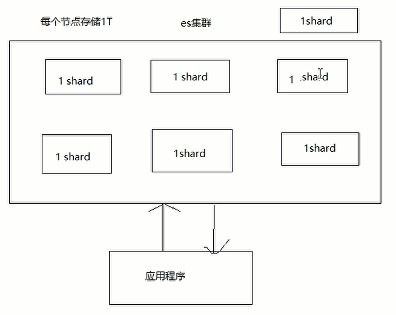

[toc]

# 手动安装单机ElasticSearch

1. 下载tar包,(6.6.2)
```shell
wget https://artifacts.elastic.co/downloads/elasticsearch/elasticsearch-6.6.2.tar.gz
```
2. 解压缩之后修改配置文件
```properties
vi config/Elasticsearch.yml
network.host: 0.0.0.0 #设置成外网也可以访问
```

```properties
vi /etc/sysctl.conf
vm.max_map_count=262144 # 修改系统环境该变量,修改完需要重启才能生效

# 加载参数
sysctl -p
```

```properties
vim /etc/security/limits.conf   # 允许打开的最大文件描述

# 加入
* soft nofile 65536
* hard nofile 65536
* soft nproc 4096 或者(65536)
* hard nproc 4096 或者(65536)
```

```properties
vi config/jvm.options  # 修改JVM分配大小 这两个值要一致
-Xms1g
-Xmx1g
```
3. 启动
```shell
bin/elasticsearch
bin/elasticsearch -d  #后台启动
```
4. 安装分词器
下载解压缩的哦elasticsearch的plugin目录下
IK分词器
https://github.com/medcl/elasticsearch-analysis-ik/releases/tag/v6.6.2
```shell
POST /_analyze { "analyzer": "ik_smart", "text": " 程序员 }
```
拼音分词器
https://github.com/medcl/elasticsearch-analysis-pinyin/releases/tag/v6.6.2
```json
GET /medcl/_analyze
    {
    "text": ["程序员"],
    "analyzer": "pinyin_analyzer"
    }
```

# 手动安装集群ElasticSearch

1.修改一台elasticsearch的elasticsearch.yml

```shell
cluster.name: kkb-es
node.name: node0
node.master: true
network.host: 0.0.0.0
http.port: 9200
transport.tcp.port: 9300
discovery.zen.ping.unicast.hosts: ["127.0.0.1:9300","127.0.0.1:9301","127.0.0
.1:9302"]
discovery.zen.minimum_master_nodes: 2
http.cors.enabled: true
http.cors.allow-origin: "*"
```

2.拷贝到其他的服务器

修改上面呢的配置文件中的3个配置

```
node.name: node0
http.port: 9200
transport.tcp.port: 9300
```

3.检查健康状态

```shell
http://localhost:9200/_cat/health?v
```


# 手动单机Kibana安装

1. 下载解压
```shell
https://artifacts.elastic.co/downloads/kibana/kibana-6.6.2-linux-x86_64.tar.gz
```
2. 修改配置文件
```shell
vi kibana-6.4.2-linux-x86_64/config/kibana.yml
server.port: 5600
server.host: "0.0.0.0"
elasticsearch.url: "http://localhost:9200"
```
3. 启动
```shell
./bin/kibana
```


# 手动单机Logstash安装

`mysql-connector-java-5.1.48.jar`是放在`logstash-6.6.2/logstash-core/lib/jars`,这样就不需要写相对路径了

```json
input {
    jdbc {
        jdbc_driver_library => "mysql-connector-java-5.1.48.jar"
        jdbc_driver_class => "com.mysql.jdbc.Driver"
        jdbc_connection_string => "jdbc:mysql://192.168.111.128:3306/ssm"
        jdbc_user => "root"
        jdbc_password => "123456"
        jdbc_paging_enabled => "true"
        jdbc_page_size => "2"
        statement => "SELECT id,'name',phone FROM phone where update_data >= :sql_last_value"
        tracking_column_type => "timestamp"
        tracking_column => "update_date"
        schedule => "* * * * *"
    }
}
output {
    elasticsearch {
        index => "phone"
        document_id=> "%{id}"
        hosts => ["http://192.168.111.128:9200"]
    }
}
```

启动命令

```shell
./logstash -f ../config/logstash-sample.conf
```

# API简单使用

## 查询索引和映射

```shell
# 这两个都是查看索引,只是第三行比第三行多几个字段
GET lib
GET /lib/_settings

# 查询所有索引
GET /_all/_settings

# 查询映射
GET /lib2/_mapping
```

## 添加索引

```shell
# 方式一,使用的是默认的配置
PUT /lib

# 方式二
PUT /lib/
{
  "settings": {
    "index": {
      "number_of_shards": 5,
      "number_of_replicas": 1
    }
  }
}

# 方式三,指定字段类型
PUT /lib3
{
  "mappings": {
    "user":{
      "properties":{
        "name":{"type":"text"},
        "address":{"type":"text"},
        "age":{"type":"text"},
        "interests":{"type":"text"},
        "birthday":{"type":"text"}
      }
    }
  }
}
```

## 添加文档

```shell
# 指定id的时候用PUT
PUT /lib/user/1
{
    "first_name":"Jame",
    "last_name":"Smith",
    "age":"32",
    "about":"I like to collect rock albums",
    "interests":["music"]
}

# 没有指定ID用POST,创建的时候会自动生成ID
POST /lib/user/
{
    "first_name":"anthony",
    "last_name":"Smith",
    "age":"32",
    "about":"I like to collect rock albums",
    "interests":["music"]
}
```

## 查询文档

```shell
# 指定ID
GET /lib/user/1

# 查看文档中的指定字段
GET /lib/user/1?_source=age,about

# 查询索引下的所有文档
GET /tt/ttt/_search
```

## 更新文档

```shell
# 以覆盖的方式,如果有这个id,就覆盖更新,如果没有id,就创建
PUT /lib/user/1
{
    "first_name":"Jame",
    "last_name":"Smith",
    "age":"36",
    "about":"I like to collect rock albums",
    "interests":["music"]
}

# 只是更新文档
POST /lib/user/1/_update
{
  "doc":{
     "age":"37"
  }
}
```

## 删除文档和索引

```shell
# 删除文档
DELETE /lib/user/1 

# 删除索引
DELETE /lib
```

## MuliGet
MuliGet 需要ID,才能实现
```shell
# 批量查询,这是查出全部数据
GET /_mget
{
  "docs":[
    {
      "_index":"lib",
      "_type":"user",
      "_id":1
    },
    {
      "_index":"lib",
      "_type":"user",
      "_id":2
    },
    {
      "_index":"lib",
      "_type":"user",
      "_id":3
    }
    ]
}

# 批量查询,筛选字段
GET /_mget
{
  "docs":[
    {
      "_index":"lib",
      "_type":"user",
      "_id":1,
      "_source":"interests"
    },
    {
      "_index":"lib",
      "_type":"user",
      "_id":2,
      "_source":["interests","age"]
    }]
}

# MuliGet批量查询的是同一个文档时候,可以简写方式
GET /lib/user/_mget
{
  "docs": [
    {
      "_id": 1
    },
    {
      "_type": "user",
      "_id": 2
    }
  ]
}

# 更简单的方式
GET /lib/user/_mget
{
   "ids": ["1","2"]
}
```

## Bulk批量插入
bulk的格式：

```shell
{action:{metadata}}
{requstbody}
```

* action:
	* create：文档不存在时创建
	* update:更新文档
	* index:创建新文档或替换已有文档
	* delete:删除一个文档
* metadata:
	* index
	* _type
	* _id

create 和index的区别:如果数据存在，使用create操作失败，会提示文档已经存在，使用index则可以成功执行。

bulk一次最大处理多少数据量:

　　bulk会把将要处理的数据载入内存中，所以数据量是有限制的，最佳的数据量不是一个确定的数值，它取决于你的硬件，你的文档大小以及复杂性，你的索引以及搜索的负载。一般建议是1000-5000个文档，大小建议是5-15MB，默认不能超过100M，可以在es的配置文件（即$ES_HOME下的config下的elasticsearch.yml）中。


```shell
# 批量删除,delete不需要请求体
{"delete":{"_index":"lib","_type":"user","_id":"1"}}

# 批量添加
POST /lib2/books/_bulk
{"index":{"_id":1}}
{"title":"java","price":55}
{"index":{"_id":2}}
{"title":"html5","price":55}
{"index":{"_id":3}}
{"title":"php","price":35}
{"index":{"_id":4}}
{"title":"python","price":50}

# 批量获取
GET /lib2/books/_mget
{
	"ids": ["1","2","3","4"]
}

# 批量操作
POST /lib2/books/_bulk
{"delete":{"_index":"lib2","_type":"books","_id":4}}
{"create":{"_index":"tt","_type":"ttt","_id":"100"}}
{"name":"lisi"}
{"index":{"_index":"tt","_type":"ttt"}}
{"name":"zhaosi"}
{"update":{"_index":"lib2","_type":"books","_id":"4"}}
{"doc":{"price":58}}
```


## 基本查询(Query查询)

### term和terms查询

* term 查询会去倒排索引中寻找确切的tem,它并不知道分词器的存在,这种查询使用keyword,numeric,date,在没有使用分词器的时候使用

* term 查询某个字段里含有某个关键词的文档

* terms:查询某个字段里含有多个关键词的文档

```shell
# term，name含有“zhaoming”
GET /lib3/user/_search/
{
  "query":{
    "term": {"name": "zhaoming"}
  }
}

# terms，name含有“zhou”或者还有"yang"的查出来
GET /lib3/user/_search/
{
  "query":{
    "terms": {
      "name": ["zhou","yang"]
    }
  }
}
```

### form和size分页

form是从0开始的,size是取多少个

```shell
GET /lib3/user/_search/
{
  "version": true,  # 查询的时候如果需要返回version的话
  "from": 0, 
  "size": 1, 
  "query":{
    "terms": {
      "name": ["zhou","lisi"]
    }
  
}
```


```json
GET article/_count
{
  "query": {
    "match": {
      "title": "金融"
    }
  }
}
```

### match查询

match query知道分词器的存在，会对filed进行分词操作，然后再查询

* match_all:查询所有文档

* match:查询一个字段

* multi_match:查询多个字段
* match_phrase:包含得含有一样的,而且顺序还一样的,可以不用完整
* match_phrase_prefix: 前缀匹配

```shell
# match是知道分词器的存在的,所以会去查询name是lisi的,或者name是zhaoming的(or的关系)
GET /lib3/user/_search
{
  "query":{
    "match": {
      "name": "lisi zhaoming"
    }
  }
}

# 可以指定多个字段
GET /lib3/user/_search
{
    "query":{
        "multi_match": {
            "query": "lvyou",
            "fields": ["interests","name"]
         }
    }
}

# 短语匹配(要完全匹配),包含的关系
GET /lib3/user/_search
{
  "query":{
    "match_phrase": {
      "interests": "lvyou, duanlian "
    }
  }
}

# 前缀匹配
GET /lib3/user/_search
{
  "query":{
    "match_phrase_prefix": {
      "name": "zhao"
    }
  }
}
```

### _source控制返回字段

```shell
# 指定返回的字段
GET /lib3/user/_search
{
    "_source": ["address","name"],
    "query": {
        "match": {
            "interests": "changge"
        }
    }
}

# 包含和排除返回字段
GET /lib3/user/_search
{
    "query": {
        "match_all": {}
    },
    "_source": {
          "includes": ["name","address"], # 包含这些字段
          "excludes": ["age","birthday"]  # 排除这些字段
      }
}

# 使用通配符*
GET /lib3/user/_search
{
    "_source": {
          "includes": "addr*", 
          "excludes": ["name","bir*"]        
    },
    "query": {
        "match_all": {}
    }
}
```

### sort排序

```shell
# 指定排序字段
GET /lib3/user/_search
{
  "query":{
    "match_all": {}
  },
  "sort": [
    {
      "age": {
        "order": "desc"
      }
    }
  ]
}

# 控制范围
GET /lib3/user/_search
{
  "query":{
    "range": {
      "age": {
        "gte": 20,
        "lte": 38,
        "include_lower":true,   # true包含,false不包含,下限
        "include_upper":true    # true包含,false不包含,上限
      }
    }
  },
  "sort": [
    {
      "age": {
        "order": "asc"
      }
    }
  ]
}
```

### wildcard通配符查询

允许使用通配符* 和 ?来进行查询

*代表0个或多个字符

？代表任意一个字符

```shell
GET /lib3/user/_search
{
    "query": {
        "wildcard": {
             "name": "zhao*"
        }
    }
}

GET /lib3/user/_search
{
  "query": {
    "wildcard": {
      "name": {
        "value": "li?i"
      }
    }
  }
}
```

### fuzzy模糊查询

* value：查询的关键字

* boost：查询的权值，默认值是1.0

* min_similarity:设置匹配的最小相似度，默认值为0.5，对于字符串，取值为0-1(包括0和1);对于数值，取值可能大于1;对于日期型取值为1d,1m等，1d就代表1天

* prefix_length:指明区分词项的共同前缀长度，默认是0

* max_expansions:查询中的词项可以扩展的数目，默认可以无限大

```shell
GET /lib3/user/_search
{
  "query": {
    "fuzzy": {
      "name": {
        "value": "zhaoimng" # zhaoming写反了,也可以查出来
      }
    }
  }
}
```

### 高亮搜索

```shell
GET /lib3/user/_search
{
  "query": {
    "fuzzy": {
      "name": {
        "value": "zhaoimng"
      }
    }
  },
  "highlight": {
    "fields": {
      "name":{}
    }
  }
}
```

### Filter查询

是不计算相关性的,同时可以缓存,因此,filter速度要快于query

```shell
# 过滤价格是40的
GET /lib4/items/_search
{
  "query": {
    "bool": {
      "filter": {
        "term":{"price": "40"} 
      }
    }
  }
}

# 过滤价格是25的和40的
GET /lib4/items/_search
{
  "query": {
    "bool": {
      "filter": {
        "terms":{"price": [25,40]} 
      }
    }
  }
}
```

### bool过滤查询
可以实现组合过滤查询

格式：

```shell 
{
    "bool": {
        "must": [],
        "should": [],
        "must_not": []
    }
}
```

must:必须满足的条件---and

should：可以满足也可以不满足的条件--or

must_not:不需要满足的条件--not

```shell
# 翻译过来:要是是价格是250,或者是itemID是:id100123,并且price不能是30
GET /lib4/items/_search
{
  "query": {
    "bool": {
      "should": [
        {"term":{"price":250}},
        {"term":{"itemID":"id100123"}}
      ],
      "must_not": [
        {"term":{"price":30}}
      ]
    }
  }
}
```

过滤,要想明白跟普通查询的过滤有什么不一样

```shell
GET /lib4/items/_search
{
  "query": {
    "bool": {
      "filter": {
        "range": {
          "price": {
            "gte": 40,
            "lte": 250
          }
        }
      }
    }
  }
}
```

获取非空的文档

```shell
GET /lib4/items/_search
{
  "query": {
   "bool": {
     "filter": {
       "exists": {
         "field": "price"
       }
     }
   }
  }
}
```

### 聚合查询

```shell
GET /lib4/items/_search
{
  "size":0, # 只显示总和
  "aggs":{
    "price_of_sum":{
      "sum":{
        "field":"price"
      }
    }
  }
}

# 最大值
GET /lib4/items/_search
{
  "aggs":{
    "price_of_sum":{
      "max":{
        "field":"price"
      }
    }
  }
}

# 最小值
GET /lib4/items/_search
{
  "aggs":{
    "price_of_sum":{  # price_of_sum这个名字随便起的
      "min":{
        "field":"price"
      }
    }
  }
}

# 求平均数
GET /lib4/items/_search
{
  "aggs":{
    "price_of_sum":{
      "avg":{
        "field":"price"
      }
    }
  }
}

# 价格有不相同的数
GET /lib4/items/_search
{
  "aggs":{
    "price_of_sum":{
      "cardinality":{
        "field":"price"
      }
    }
  }
}

# 分组
GET /lib4/items/_search
{
  "size": 0, 
  "aggs":{
    "price_of_sum":{
      "terms":{
        "field":"price"
      }
    }
  }
}
```

# API高级

### 版本控制

ElasticSearch采用了乐观锁来保证数据的一致性，也就是说，当用户对document进行操作时，并不需要对该document作加锁和解锁的操作，只需要指定要操作的版本即可。当版本号一致时，ElasticSearch会允许该操作顺利执行，而当版本号存在冲突时，ElasticSearch会提示冲突并抛出异常（VersionConflictEngineException异常）。

ElasticSearch的版本号的取值范围为1到2^63-1。

内部版本控制：使用的是_version


外部版本控制：elasticsearch在处理外部版本号时会与对内部版本号的处理有些不同。它不再是检查_version是否与请求中指定的数值_相同_,而是检查当前的_version是否比指定的数值小。如果请求成功，那么外部的版本号就会被存储到文档中的_version中。

为了保持_version与外部版本控制的数据一致
使用version_type=external

### 数据类型

核心数据类型（Core datatypes）

```shell
字符型：string，string类型包括
text 和 keyword

text类型被用来索引长文本，在建立索引前会将这些文本进行分词，转化为词的组合，建立索引。允许es来检索这些词语。text类型不能用来排序和聚合。

Keyword类型不需要进行分词，可以被用来检索过滤、排序和聚合。keyword 类型字段只能用本身来进行检索

数字型：long, integer, short, byte, double, float
日期型：date
布尔型：boolean
二进制型：binary
```

复杂数据类型（Complex datatypes）

```shell
数组类型（Array datatype）：数组类型不需要专门指定数组元素的type，例如：
    字符型数组: [ "one", "two" ]
    整型数组：[ 1, 2 ]
    数组型数组：[ 1, [ 2, 3 ]] 等价于[ 1, 2, 3 ]
    对象数组：[ { "name": "Mary", "age": 12 }, { "name": "John", "age": 10 }]
对象类型（Object datatype）：_ object _ 用于单个JSON对象；
嵌套类型（Nested datatype）：_ nested _ 用于JSON数组；
```

地理位置类型（Geo datatypes）

```shell
地理坐标类型（Geo-point datatype）：_ geo_point _ 用于经纬度坐标；
地理形状类型（Geo-Shape datatype）：_ geo_shape _ 用于类似于多边形的复杂形状；
```

特定类型（Specialised datatypes）

```shell
IPv4 类型（IPv4 datatype）：_ ip _ 用于IPv4 地址；
Completion 类型（Completion datatype）：_ completion _提供自动补全建议；
Token count 类型（Token count datatype）：_ token_count _ 用于统计做了标记的字段的index数目，该值会一直增加，不会因为过滤条件而减少。
mapper-murmur3
类型：通过插件，可以通过 _ murmur3 _ 来计算 index 的 hash 值；
附加类型（Attachment datatype）：采用 mapper-attachments
插件，可支持_ attachments _ 索引，例如 Microsoft Office 格式，Open Document 格式，ePub, HTML 等。
```

支持的属性：

```shell
"store":false//是否单独设置此字段的是否存储而从_source字段中分离，默认是false，只能搜索，不能获取值

"index": true//分词，不分词是：false，设置成false，字段将不会被索引

"analyzer":"ik"//指定分词器,默认分词器为standard analyzer

"boost":1.23//字段级别的分数加权，默认值是1.0

"doc_values":false//对not_analyzed字段，默认都是开启，分词字段不能使用，对排序和聚合能提升较大性能，节约内存

"fielddata":{"format":"disabled"}//针对分词字段，参与排序或聚合时能提高性能，不分词字段统一建议使用doc_value

"fields":{"raw":{"type":"string","index":"not_analyzed"}} //可以对一个字段提供多种索引模式，同一个字段的值，一个分词，一个不分词
            
"ignore_above":100 //超过100个字符的文本，将会被忽略，不被索引

"include_in_all":ture//设置是否此字段包含在_all字段中，默认是true，除非index设置成no选项

"index_options":"docs"//4个可选参数docs（索引文档号） ,freqs（文档号+词频），positions（文档号+词频+位置，通常用来距离查询），offsets（文档号+词频+位置+偏移量，通常被使用在高亮字段）分词字段默认是position，其他的默认是docs

"norms":{"enable":true,"loading":"lazy"}//分词字段默认配置，不分词字段：默认{"enable":false}，存储长度因子和索引时boost，建议对需要参与评分字段使用 ，会额外增加内存消耗量

"null_value":"NULL"//设置一些缺失字段的初始化值，只有string可以使用，分词字段的null值也会被分词

"position_increament_gap":0//影响距离查询或近似查询，可以设置在多值字段的数据上火分词字段上，查询时可指定slop间隔，默认值是100

"search_analyzer":"ik"//设置搜索时的分词器，默认跟ananlyzer是一致的，比如index时用standard+ngram，搜索时用standard用来完成自动提示功能

"similarity":"BM25"//默认是TF/IDF算法，指定一个字段评分策略，仅仅对字符串型和分词类型有效

"term_vector":"no"//默认不存储向量信息，支持参数yes（term存储），with_positions（term+位置）,with_offsets（term+偏移量），with_positions_offsets(term+位置+偏移量) 对快速高亮fast vector highlighter能提升性能，但开启又会加大索引体积，不适合大数据量用
```


# ElasticSearch原理

### 解析es的分布式架构

分片的副本：

集群发现机制(cluster discovery)：比如当前我们启动了一个es进程，当启动了第二个es进程时，这个进程作为一个node自动就发现了集群，并且加入了进去

shard负载均衡：比如现在有10shard，集群中有3个节点，es会进行均衡的进行分配，以保持每个节点均衡的负载请求

请求路由 

#### 扩容机制

垂直扩容：购置新的机器，替换已有的机器

例子:一台有6台机器,每台1T,一共6T,现在替换掉其中的两台,1T升级到2T,这样一共就有8T

水平扩容：直接增加机器

#### rebalance

增加或减少节点时会自动均衡



#### master节点

主节点的主要职责是和集群操作相关的内容，如创建或删除索引，跟踪哪些节点是群集的一部分，并决定哪些分片分配给相关的节点。稳定的主节点对集群的健康是非常重要的。一个集群,至少有一个master.并不是所有的请求都请求master

#### 节点对等

每个节点都能接收请求
每个节点接收到请求后都能把该请求路由到有相关数据的其它节点上
接收原始请求的节点负责采集数据并返回给客户端

### 分片和副本机制

1. index包含多个shard

2. 每个shard都是一个最小工作单元，承载部分数据；每个shard都是一个lucene实例，有完整的建立索引和处理请求的能力

3. 增减节点时，shard会自动在nodes中负载均衡

4. primary shard和replica shard，每个document肯定只存在于某一个primary shard以及其对应的replica shard中，不可能存在于多个primary shard

5. replica shard是primary shard的副本，负责容错，以及承担读请求负载

6. primary shard的数量在创建索引的时候就固定了，replica shard的数量可以随时修改

7. primary shard的默认数量是5，replica默认是1，默认有10个shard，5个primary shard，5个replica shard

8. primary shard不能和自己的replica shard放在同一个节点上（否则节点宕机，primary shard和副本都丢失，起不到容错的作用），但是可以和其他primary shard的replica shard放在同一个节点上


### 单节点环境下创建索引分析

```shell
PUT /myindex
{
   "settings" : {
      "number_of_shards" : 3,  # 3个朱分片
      "number_of_replicas" : 1  # 1个负分片
   }
}
```

这个时候，只会将3个primary shard分配到仅有的一个node上去，另外3个replica shard是无法分配的（一个shard的副本replica，他们两个是不能在同一个节点的）。集群可以正常工作，但是一旦出现节点宕机，数据全部丢失，而且集群不可用，无法接收任何请求。

### 两个节点环境下创建索引分析

将3个primary shard分配到一个node上去，另外3个replica shard分配到另一个节点上

primary shard 和replica shard 保持同步

primary shard 和replica shard 都可以处理客户端的读请求


### 水平扩容的过程

1. 扩容后primary shard和replica shard会自动的负载均衡

2. 扩容后每个节点上的shard会减少，那么分配给每个shard的CPU，内存，IO资源会更多，性能提高

3. 扩容的极限，如果有6个shard，扩容的极限就是6个节点，每个节点上一个shard，如果想超出扩容的极限，比如说扩容到9个节点，那么可以增加replica shard的个数

4. 6个shard，3个节点，最多能承受几个节点所在的服务器宕机？(容错性)
	任何一台服务器宕机都会丢失部分数据

为了提高容错性，增加shard的个数：
9个shard，(3个primary shard，6个replicashard)，这样就能容忍最多两台服务器宕机了

总结：扩容是为了提高系统的吞吐量，同时也要考虑容错性，也就是让尽可能多的服务器宕机还能保证数据不丢失


### ElasticSearch的容错机制

以9个shard，3个节点为例：

1.如果master node 宕机，此时不是所有的primary shard都是Active status，所以此时的集群状态是red。

容错处理的第一步:是选举一台服务器作为master
容错处理的第二步:新选举出的master会把挂掉的primary shard的某个replica shard 提升为primary shard,此时集群的状态为yellow，因为少了一个replica shard，并不是所有的replica shard都是active status

容错处理的第三步：重启故障机，新master会把所有的副本都复制一份到该节点上，（同步一下宕机后发生的修改），此时集群的状态为green，因为所有的primary shard和replica shard都是Active status

### 文档的核心元数据

1. `_index`:

说明了一个文档存储在哪个索引中

同一个索引下存放的是相似的文档(文档的field多数是相同的)

索引名必须是小写的，不能以下划线开头，不能包括逗号

2. `_type`:

表示文档属于索引中的哪个类型

一个索引下只能有一个type

类型名可以是大写也可以是小写的，不能以下划线开头，不能包括逗号

3. `_id`:

文档的唯一标识，和索引，类型组合在一起唯一标识了一个文档

可以手动指定值，也可以由es来生成这个值

### 文档id生成方式

1.手动指定

```shell
put /index/type/66
```

  通常是把其它系统的已有数据导入到es时

2.由es生成id值

```shell
post /index/type
```

 es生成的id长度为20个字符，使用的是base64编码，URL安全，使用的是GUID算法，分布式下并发生成id值时不会冲突


### _source元数据分析

其实就是我们在添加文档时request body中的内容

指定返回的结果中含有哪些字段：

get /index/type/1?_source=name


### 改变文档内容原理解析

替换方式(全部替换)：

```shell
PUT /lib/user/4
{ 
    "first_name" : "Jane",
    "last_name" :   "Lucy",
    "age" :         24,
    "about" :       "I like to collect rock albums",
    "interests":  [ "music" ]
}
```

修改方式(部分修改)：

```shell
POST /lib/user/2/_update
{
    "doc":{
       "age":26
     }
}
```

删除文档:

```shell
delete /lib
```

以上3个操作文档的方式,都是把已有的document标记为deleted，随着数据量的增加，es会选择合适的时间删除掉

### 基于groovy脚本执行partial update

es有内置的脚本支持，可以基于groovy脚本实现复杂的操作

```shell
1.修改年龄
POST /lib/user/4/_update
{
  "script": "ctx._source.age+=1"
}

2.修改名字
POST /lib/user/4/_update
{
  "script": "ctx._source.last_name+='hehe'"
}

3.添加爱好
POST /lib/user/4/_update
{
  "script": {
    "source": "ctx._source.interests.add(params.tag)",
    "params": {
      "tag":"picture"
    }
  }
}

4.删除爱好
POST /lib/user/4/_update
{
  "script": {
    "source": "ctx._source.interests.remove(ctx._source.interests.indexOf(params.tag))",
    "params": {
      "tag":"picture"
    }
  }
}

5.删除文档
POST /lib/user/4/_update
{
  "script": {
    "source": "ctx.op=ctx._source.age==params.count?'delete':'none'",
    "params": {
        "count":29
    }
  }
}

6.upsert
POST /lib/user/4/_update
{
  "script": "ctx._source.age += 1",

  "upsert": {
     "first_name" : "Jane",
     "last_name" :   "Lucy",
     "age" :  20,
     "about" :       "I like to collect rock albums",
     "interests":  [ "music" ]
  }
}
```

### partial update 处理并发冲突

使用的是乐观锁:_version

retry_on_conflict:

```shell
POST /lib/user/4/_update?retry_on_conflict=3
```

重新获取文档数据和版本信息进行更新，不断的操作，最多操作的次数就是retry_on_conflict的值


### 文档数据路由原理解析

1.文档路由到分片上：

 一个索引由多个分片构成，当添加(删除，修改)一个文档时，es就需要决定这个文档存储在哪个分片上，这个过程就称为数据路由(routing)

2.路由算法：

     shard=hash(routing) % number_of_pirmary_shards

示例：一个索引，3个primary shard

(1)每次增删改查时，都有一个routing值，默认是文档的_id的值

(2)对这个routing值使用哈希函数进行计算

(3)计算出的值再和主分片个数取余数

余数肯定在0---（number_of_pirmary_shards-1）之间，文档就在对应的shard上

routing值默认是文档的_id的值，也可以手动指定一个值，手动指定对于负载均衡以及提高批量读取的性能都有帮助

3.primary shard个数一旦确定就不能修改了

### 文档增删改内部原理 

1:发送增删改请求时，可以选择任意一个节点，该节点就成了协调节点(coordinating node)

2.协调节点使用路由算法进行路由，然后将请求转到primary shard所在节点，该节点处理请求，并把数据同步到它的replica shard

3.协调节点对客户端做出响应


### 写一致性原理和quorum机制

1. 任何一个增删改操作都可以跟上一个参数:``consistency`

可以给该参数指定的值：

```shell
one: (primary shard)只要有一个primary shard是活跃的就可以执行

all: (all shard)所有的primary shard和replica shard都是活跃的才能执行

quorum: (default) 默认值，大部分shard是活跃的才能执行 （例如共有6个shard，至少有3个shard是活跃的才能执行写操作）
```

2. quorum机制：多数shard都是可用的，

int((primary+number_of_replica)/2)+1

例如：3个primary shard，1个replica

int((3+1)/2)+1=3

至少3个shard是活跃的

注意：可能出现shard不能分配齐全的情况

比如：1个primary shard,1个replica
int((1+1)/2)+1=2
但是如果只有一个节点，因为primary shard和replica shard不能在同一个节点上，所以仍然不能执行写操作

再举例：1个primary shard,3个replica,2个节点

int((1+3)/2)+1=3

最后:当活跃的shard的个数没有达到要求时，
es默认会等待一分钟，如果在等待的期间活跃的shard的个数没有增加，则显示timeout

put /index/type/id?timeout=60s


### 文档查询内部原理

第一步：查询请求发给任意一个节点，该节点就成了coordinating node，该节点使用路由算法算出文档所在的primary shard

第二步：协调节点把请求转发给primary shard也可以转发给replica shard(使用轮询调度算法(Round-Robin Scheduling，把请求平均分配至primary shard 和replica shard)

第三步：处理请求的节点把结果返回给协调节点，协调节点再返回给应用程序

特殊情况：请求的文档还在建立索引的过程中，primary shard上存在，但replica shar上不存在，但是请求被转发到了replica shard上，这时就会提示找不到文档


### bulk批量操作的json格式解析

bulk的格式：

```shell
{action:{metadata}}\n
{requstbody}\n
```

为什么不使用如下格式：

```shell
[{
    "action": {
    },
    "data": {
    }
}]
```

这种方式可读性好，但是内部处理就麻烦了：

1.将json数组解析为JSONArray对象，在内存中就需要有一份json文本的拷贝，另外还有一个JSONArray对象。

2.解析json数组里的每个json，对每个请求中的document进行路由

3.为路由到同一个shard上的多个请求，创建一个请求数组

4.将这个请求数组序列化

5.将序列化后的请求数组发送到对应的节点上去

耗费更多内存，增加java虚拟机开销

1.不用将其转换为json对象，直接按照换行符切割json，内存中不需要json文本的拷贝

2.对每两个一组的json，读取meta，进行document路由

3.直接将对应的json发送到node上去

### 查询结果分析

```shell
{
  # 查询耗费的时间，单位是毫秒
  "took": 419,  
  # 超时时间
  "timed_out": false,
  # 共请求了多少个shard
  "_shards": {
  	# 查询出的文档总个数
    "total": 3,
    "successful": 3,
    "skipped": 0,
    "failed": 0
  },
  "hits": {
    "total": 3,
    # 本次查询中，相关度分数的最大值，文档和此次查询的匹配度越高，_score的值越大，排位越靠前
    "max_score": 0.6931472,
    # 默认查询前10个文档
    "hits": [
      {
        "_index": "lib3",
        "_type": "user",
        "_id": "3",
        "_score": 0.6931472,
        "_source": {
          "address": "bei jing hai dian qu qing he zhen",
          "name": "lisi"
        }
      },
      {
        "_index": "lib3",
        "_type": "user",
        "_id": "2",
        "_score": 0.47000363,
        "_source": {
          "address": "bei jing hai dian qu qing he zhen",
          "name": "zhaoming"
        }
      }
```

```shell
# 设置超时时间
GET /lib3/user/_search?timeout=10ms
{
    "_source": ["address","name"],
    "query": {
        "match": {
            "interests": "changge"
        }
    }
}
```

### 分页查询中的deep paging问题

```shell
GET /lib3/user/_search
{
    "from":0,
    "size":2,
    "query":{
        "terms":{
            "interests": ["hejiu","changge"]
        }
    }
}

GET /_search?from=0&size=3
```

deep paging:查询的很深，比如一个索引有三个primary shard，分别存储了6000条数据，我们要得到第100页的数据(每页10条)，类似这种情况就叫deep paging

如何得到第100页的10条数据？

在每个shard中搜索990到999这10条数据，然后用这30条数据排序，排序之后取10条数据就是要搜索的数据，这种做法是错的，因为3个shard中的数据的_score分数不一样，可能这某一个shard中第一条数据的_score分数比另一个shard中第1000条都要高，所以在每个shard中搜索990到999这10条数据然后排序的做法是不正确的。

正确的做法是每个shard把0到999条数据全部搜索出来（按排序顺序），然后全部返回给coordinate node，由coordinate node按_score分数排序后，取出第100页的10条数据，然后返回给客户端。


deep paging性能问题

1.耗费网络带宽，因为搜索过深的话，各shard要把数据传送给coordinate node，这个过程是有大量数据传递的，消耗网络，

2.消耗内存，各shard要把数据传送给coordinate node，这个传递回来的数据，是被coordinate node保存在内存中的，这样会大量消耗内存。

3.消耗cpu coordinate node要把传回来的数据进行排序，这个排序过程很消耗cpu.

鉴于deep paging的性能问题，所以应尽量减少使用。


### query string查询及copy_to解析

GET /lib3/user/_search?q=interests:changge

GET /lib3/user/_search?q=+interests:changge

GET /lib3/user/_search?q=-interests:changge

copy_to字段是把其它字段中的值，以空格为分隔符组成一个大字符串，然后被分析和索引，但是不存储，也就是说它能被查询，但不能被取回显示。

注意:copy_to指向的字段字段类型要为：text

当没有指定field时，就会从copy_to字段中查询
GET /lib3/user/_search?q=changge


### 字符串排序问题

对一个字符串类型的字段进行排序通常不准确，因为已经被分词成多个词条了

解决方式：对字段索引两次，一次索引分词（用于搜索），一次索引不分词(用于排序)

```shell
# 设置mapping
PUT /lib3
{
    "settings":{
        "number_of_shards" : 3,
        "number_of_replicas" : 0
      },
     "mappings":{
      "user":{
        "properties":{
            "name": {"type":"text"},
            "address": {"type":"text"},
            "age": {"type":"integer"},
            "birthday": {"type":"date"},
            "interests": {
                "type":"text",
                # 重点是在这下面
                "fields": {
                  "raw":{
                     "type": "keyword"
                   }
                },
                "fielddata": true
             }
          }
        }
     }
}

GET /lib3/user/_search
{
  "query": {
    "match_all": {}
  },
  "sort": [
    {
      "interests": {
        "order": "desc"
      }
    }
  ]
}

GET /lib3/user/_search
{
  "query": {
    "match_all": {}
  },
  "sort": [
    {
      "interests.raw": {
        "order": "asc"
      }
    }
  ]
}
```


### 如何计算相关度分数

使用的是TF/IDF算法(Term Frequency&Inverse Document Frequency)

1.Term Frequency:我们查询的文本中的词条在document本中出现了多少次，出现次数越多，相关度越高

搜索内容： hello world

Hello，I love china.

Hello world,how are you!

2.Inverse Document Frequency：我们查询的文本中的词条在索引的所有文档中出现了多少次，出现的次数越多，相关度越低

搜索内容：hello world

hello，what are you doing?

I like the world.

hello 在索引的所有文档中出现了500次，world出现了100次

3.Field-length(字段长度归约) norm:field越长，相关度越低

搜索内容：hello world

{"title":"hello,what's your name?","content":{"owieurowieuolsdjflk"}}

{"title":"hi,good morning","content":{"lkjkljkj.......world"}}


查看分数是如何计算的：

GET /lib3/user/_search?explain=true
{
    "query":{
        "match":{
            "interests": "duanlian,changge"
        }
    }
}

查看一个文档能否匹配上某个查询：

GET /lib3/user/2/_explain
{
    "query":{
        "match":{
            "interests": "duanlian,changge"
        }
    }
}


### Doc Values 解析

DocValues其实是Lucene在构建倒排索引时，会额外建立一个有序的正排索引(基于document => field value的映射列表),字符串不会创建正排索引

```shell
{"birthday":"1985-11-11",age:23}

{"birthday":"1989-11-11",age:29}

document     age       birthday
doc1         23         1985-11-11
doc2         29         1989-11-11
```

存储在磁盘上，节省内存 

对排序，分组和一些聚合操作能够大大提升性能 

注意：默认对不分词的字段是开启的，对分词字段无效（需要把fielddata设置为true）

```shell
PUT /lib3
{
    "settings":{
    "number_of_shards" : 3,
    "number_of_replicas" : 0
    },
     "mappings":{
      "user":{
        "properties":{
            "name": {"type":"text"},
            "address": {"type":"text"},
            "age": {
              "type":"integer",
              "doc_values":false
            },
            "interests": {"type":"text"},
            "birthday": {"type":"date"}
        }
      }
     }
}
```


### 基于scroll技术滚动搜索大量数据

如果一次性要查出来比如10万条数据，那么性能会很差，此时一般会采取用scoll滚动查询，一批一批的查，直到所有数据都查询完为止。

1.scoll搜索会在第一次搜索的时候，保存一个当时的视图快照，之后只会基于该旧的视图快照提供数据搜索，如果这个期间数据变更，是不会让用户看到的

2.采用基于_doc(不使用_score)进行排序的方式，性能较高

3.每次发送scroll请求，我们还需要指定一个scoll参数，指定一个时间窗口，每次搜索请求只要在这个时间窗口内能完成就可以了

```shell
GET /lib3/user/_search?scroll=1m
{
  "query": {
    "match_all": {}
  },
  "sort":["_doc"],
  # 一批查多少个
  "size":3
}

GET /_search/scroll
{
   "scroll": "1m",
   # 这个是上面那个查询里获取到的
   "scroll_id": "DnF1ZXJ5VGhlbkZldGNoAwAAAAAAAAAdFkEwRENOVTdnUUJPWVZUd1p2WE5hV2cAAAAAAAAAHhZBMERDTlU3Z1FCT1lWVHdadlhOYVdnAAAAAAAAAB8WQTBEQ05VN2dRQk9ZVlR3WnZYTmFXZw=="
}
```

### dynamic mapping策略

**dynamic**:

1.true:遇到陌生字段就 dynamic mapping

2.false:遇到陌生字段就忽略

3.strict:约到陌生字段就报错


PUT /lib8
{
    "settings":{
    "number_of_shards" : 3,
    "number_of_replicas" : 0
    },
     "mappings":{
      "user":{
        "dynamic":strict,
        "properties":{
            "name": {"type":"text"},
            "address":{
                "type":"object",
                "dynamic":true
            },
        }
      }
     }
}

#会报错

PUT  /lib8/user/1
{
  "name":"lisi",
  "age":20,
  "address":{
    "province":"beijing",
    "city":"beijing"
  }
}


**date_detection**:默认会按照一定格式识别date，比如yyyy-MM-dd

可以手动关闭某个type的date_detection

PUT /lib8
{
    "settings":{
    "number_of_shards" : 3,
    "number_of_replicas" : 0
    },
     "mappings":{
      "user":{
        "date_detection": false,
        }
    }
}


**定制 dynamic mapping template(type)**

PUT /my_index
{ 
  "mappings": { 
    "my_type": { 
      "dynamic_templates": [ 
        { 
          "en": { 
            "match": "*_en", 
            "match_mapping_type": "string", 
            "mapping": { 
              "type": "text", 
              "analyzer": "english" 
            } 
          } 
        } 
      ] 
     } 
  } 
}
#使用了模板

PUT /my_index/my_type/3
{
  "title_en": "this is my dog"

}
#没有使用模板

PUT /my_index/my_type/5
{
  "title": "this is my cat"
}

GET my_index/my_type/_search
{
  "query": {
    "match": {
      "title": "is"
    }
  }
}

### 重建索引

一个field的设置是不能修改的，如果要修改一个field，那么应该重新按照新的mapping，建立一个index，然后将数据批量查询出来，重新用bulk api写入到index中。

批量查询的时候，建议采用scroll api，并且采用多线程并发的方式来reindex数据，每次scroll就查询指定日期的一段数据，交给一个线程即可。

```shell
# 原始的数据
PUT /index1/type1/4
{
   "content":"1990-12-12"
}

#报错
PUT /index1/type1/4
{
   "content":"I am very happy."
}

#修改content的类型为string类型,报错，不允许修改
PUT /index1/_mapping/type1
{
  "properties": {
    "content":{
      "type": "text"
    }
  }
}
```

创建一个新的索引，把index1索引中的数据查询出来导入到新的索引中,但是应用程序使用的是之前的索引，为了不用重启应用程序，给index1这个索引起个

```shell
# 起别名
PUT /index1/_alias/index2

# 创建新的索引，把content的类型改为字符串
PUT /newindex
{
  "mappings": {
    "type1":{
      "properties": {
        "content":{
          "type": "text"
        }
      }
    }
  }
}

# 使用scroll批量查询
GET /index1/type1/_search?scroll=1m
{
  "query": {
    "match_all": {}
  },
  "sort": ["_doc"],
  "size": 2
}

#使用bulk批量写入新的索引
POST /_bulk
{"index":{"_index":"newindex","_type":"type1","_id":1}}
{"content":"1982-12-12"}

#将别名index2和新的索引关联，应用程序不用重启
POST /_aliases
{
  "actions": [
        {"remove": {"index":"index1","alias":"index2"}},
        {"add": {"index": "newindex","alias": "index2"}}
	]
}

GET index2/type1/_search
```


### 索引不可变的原因

倒排索引包括：

   文档的列表，文档的数量，词条在每个文档中出现的次数，出现的位置，每个文档的长度，所有文档的平均长度

索引不变的原因：

不需要锁，提升了并发性能

可以一直保存在缓存中（filter）

节省cpu和io开销


# 安装插件

### 安装HEAD

Head是elasticsearch的集群管理工具，可以用于数据的浏览和查询

(1)elasticsearch-head是一款开源软件，被托管在github上面，所以如果我们要使用它，必须先安装git，通过git获取elasticsearch-head

(2)运行elasticsearch-head会用到grunt，而grunt需要npm包管理器，所以nodejs是必须要安装的

(3)elasticsearch5.0之后，elasticsearch-head不做为插件放在其plugins目录下了。
使用git拷贝elasticsearch-head到本地

cd /usr/local/

 git clone git://github.com/mobz/elasticsearch-head.git

(4)安装elasticsearch-head依赖包

[root@localhost local]# npm install -g grunt-cli

[root@localhost _site]# cd /usr/local/elasticsearch-head/

[root@localhost elasticsearch-head]# cnpm install

(5)修改Gruntfile.js

[root@localhost _site]# cd /usr/local/elasticsearch-head/

[root@localhost elasticsearch-head]# vi Gruntfile.js

在connect-->server-->options下面添加：hostname:’*’，允许所有IP可以访问

(6)修改elasticsearch-head默认连接地址
[root@localhost elasticsearch-head]# cd /usr/local/elasticsearch-head/_site/

[root@localhost _site]# vi app.js

将this.base_uri = this.config.base_uri || this.prefs.get("app-base_uri") || "http://localhost:9200";中的localhost修改成你es的服务器地址

(7)配置elasticsearch允许跨域访问

打开elasticsearch的配置文件elasticsearch.yml，在文件末尾追加下面两行代码即可：

http.cors.enabled: true

http.cors.allow-origin: "*"

(8)打开9100端口

[root@localhost elasticsearch-head]# firewall-cmd --zone=public --add-port=9100/tcp --permanent

重启防火墙

[root@localhost elasticsearch-head]# firewall-cmd --reload

(9)启动elasticsearch

(10)启动elasticsearch-head

[root@localhost _site]# cd /usr/local/elasticsearch-head/

[root@localhost elasticsearch-head]# node_modules/grunt/bin/grunt server

(11)访问elasticsearch-head

关闭防火墙：systemctl stop firewalld.service

浏览器输入网址：http://192.168.25.131:9100/

### 安装中文分词器

(1)下载中文分词器
https://github.com/medcl/elasticsearch-analysis-ik

    下载elasticsearch-analysis-ik-master.zip

(2)解压elasticsearch-analysis-ik-master.zip

   unzip elasticsearch-analysis-ik-master.zip

(3)进入elasticsearch-analysis-ik-master，编译源码

mvn clean install -Dmaven.test.skip=true 

(4)在es的plugins文件夹下创建目录ik

(5)将编译后生成的elasticsearch-analysis-ik-版本.zip移动到ik下，并解压

(6)解压后的内容移动到ik目录下


#### 分词器介绍及内置分词器

分词器：从一串文本中切分出一个一个的词条，并对每个词条进行标准化

包括三部分：

character filter：分词之前的预处理，过滤掉HTML标签，特殊符号转换等

tokenizer：分词

token filter：标准化

内置分词器：

standard 分词器：(默认的)他会将词汇单元转换成小写形式，并去除停用词和标点符号，支持中文采用的方法为单字切分

simple 分词器：首先会通过非字母字符来分割文本信息，然后将词汇单元统一为小写形式。该分析器会去掉数字类型的字符。

Whitespace 分词器：仅仅是去除空格，对字符没有lowcase化,不支持中文；
并且不对生成的词汇单元进行其他的标准化处理。

language 分词器：特定语言的分词器，不支持中文


# 先记着

用logstash去同步mysql的的增量,,需要两个字段,第一个是 id,主键,第二个是update_date,  用第二个字段去查询,默认用id去去重


group by 的时候报错了

es进行聚合操作时提示Fielddata is disabled on text fields by default

https://blog.csdn.net/u011403655/article/details/71107415/

```json
# 充值笔数
GET /shouye/rukuan/_search
{
  "aggs": {
    "my_cre": {
      "terms": {
        "field": "orderId"
      }
    }
  }
}

GET /shouye/rukuan/_count

GET /shouye/_mapping

PUT shouye/_mapping/rukuan/
{
  "properties": {
    "orderId": { 
      "type":     "text",
      "fielddata": true
    }
  }
}
```


# springboot整合Elasticsearch

```xml
<?xml version="1.0" encoding="UTF-8"?>
<project xmlns="http://maven.apache.org/POM/4.0.0" xmlns:xsi="http://www.w3.org/2001/XMLSchema-instance"
         xsi:schemaLocation="http://maven.apache.org/POM/4.0.0 https://maven.apache.org/xsd/maven-4.0.0.xsd">
    <modelVersion>4.0.0</modelVersion>
    <parent>
        <groupId>com.lzkj</groupId>
        <artifactId>item2</artifactId>
        <version>0.0.1-SNAPSHOT</version>
    </parent>
    <groupId>com.es</groupId>
    <artifactId>es-server</artifactId>
    <version>0.0.1-SNAPSHOT</version>
    <name>es-server</name>
    <description>Demo project for Spring Boot</description>

    <properties>
        <java.version>1.8</java.version>
    </properties>

    <dependencies>

        <dependency>
            <groupId>org.springframework.boot</groupId>
            <artifactId>spring-boot-starter-data-elasticsearch</artifactId>
        </dependency>
        <dependency>
            <groupId>org.springframework.boot</groupId>
            <artifactId>spring-boot-starter-web</artifactId>
        </dependency>

    </dependencies>

    <build>
        <plugins>
            <plugin>
                <groupId>org.springframework.boot</groupId>
                <artifactId>spring-boot-maven-plugin</artifactId>
            </plugin>
        </plugins>
    </build>

</project>

```

```shell
spring.elasticsearch.rest.uris=http://192.168.111.132:9200
```


# 翻译文档6.6

## Getting Started

Elasticsearch is a highly scalable open-source full-text search and analytics engine. It allows you to store, search, and analyze big volumes of data quickly and in near real time. It is generally used as the underlying engine/technology that powers applications that have complex search features and requirements.