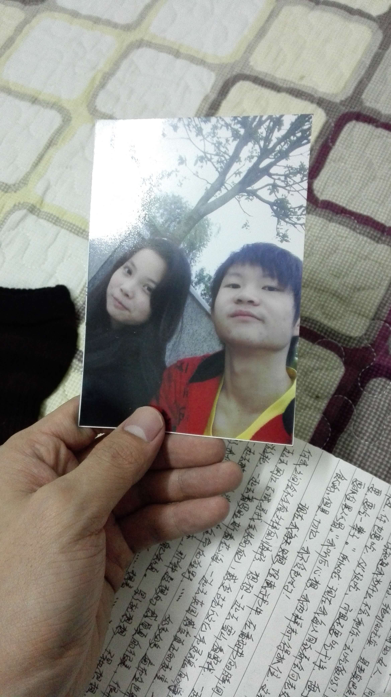

​                        寒假的总结

   心里想着是寒假能打工,一直上班上到过年的前几天放假,然后有工资拿,又打发了时间,上了三天班就让人给炒了,不过心里是没有怎么受气的,不会觉得被人炒了,觉得很丢人样,也不是明白别人为什么会炒我,唯一能想到的理由也就是周末那天早上看到主管听耳机,就跟他开玩笑说,上班能听歌?周围也有几个人听到了,似乎主管认为我给他丢人了吧.

   然后就是跟爸爸吵架,再然后不想理任何人.

  每天都能睡到中午11点才起床,或许是晚上睡得太晚了,非得2,3点钟才能睡着,算算也差不多是睡了8个小时的健康时间,每当要睡觉的时候才恍惚的回想起一天发生的事情,应该说是半天.

  经常加班加点的看电视剧,以前我都觉得男生不应该看韩剧的,在观念上认为韩剧都是特别恶心的情情爱爱,不过看多了也才发现,也并没有那么恶心,有爱情和别的主旋律穿插一起,才组成一部电视剧,现在倒是比较喜欢看韩剧,好像什么东西国外的东西都比国内的强,连电视剧都一样

  寒假看的韩剧 城市猎人,继承者们,匹诺曹,坏家伙们,Doctor异乡人,好像就是这些了,应该还有漏掉的吧.

  还有部特别的电视剧,何以萧笙默,一想到这部电视剧,突然有特别多的话想说.总之莫明其妙的看了这部电视,女主角的种种,都是我想象中女朋友的样子,短头发,漂亮,温柔,可爱,还有点特长之类的,听话,也挺高的.唐嫣演的.以前不认识她,看完这部电视剧后,就特别的喜欢她,之前不知道在哪里看到的说是,喜欢一个人,会把TA发过的所有微博全部看完,然而我就这样做了.从10年6月发的第一条微博,只有几百人点赞,评论,到现在的,几万几万的人评论点赞(可能是以前不是有太多人用微博吧),也说明了她变成明星

了.特别好看,特别完美的结局,我也是专门的看了好几遍,特别的美好,一直是我想要的样子,而且好像去实现只需要去努力就行,没有什么夸装的成分.也仅仅是因为喜欢唐嫣,又看了她主演的 千金女贼  看还是可以看,不过唐嫣的演技,也只能那样的,笑起来特别没,整部电视大部分时间好像都没有在笑.

​     明天就要上学,昨天把以前的写的情书和信之类的都翻出来的,原本以为这张照片在黄鑫那里,或者是不见了,原来夹在信里面,看完又说不出的感慨,可能是我有点后悔了样子,原来我以前是长那个样子的.原来黄鑫也是长那个样子的.这照片不能多看,越看越心疼

