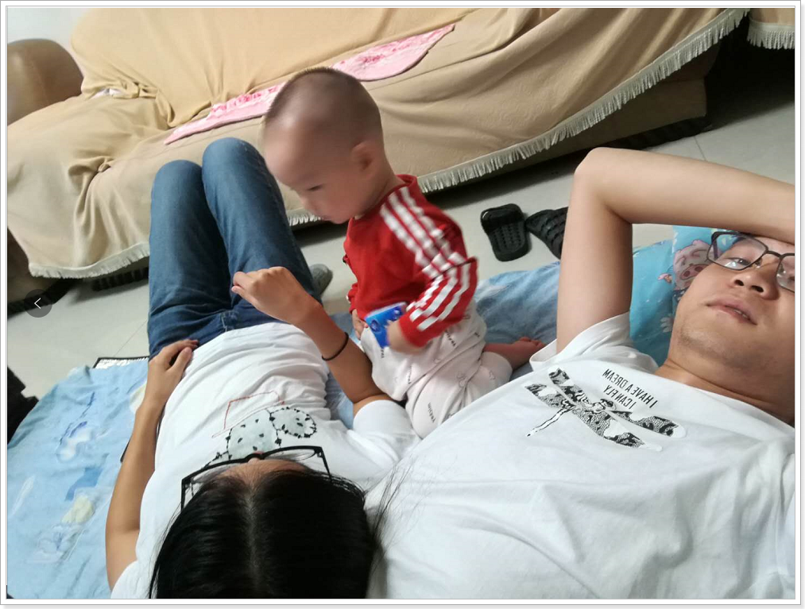
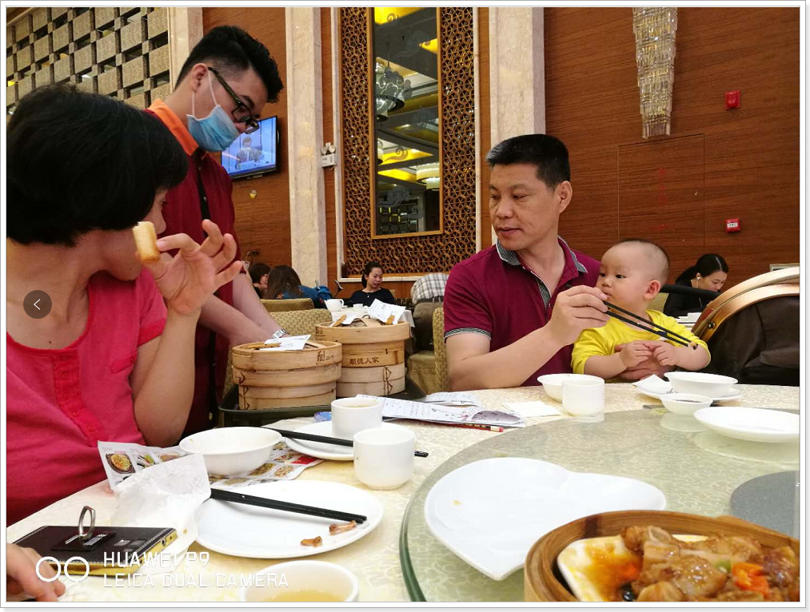

又是好久都没有写日记了,当然这也不想8月份的时候一样天灾人祸,更多是没有什么好写的,对人生也没有什么感悟,这两个星期都在认真的上班,每天都是满打满算的上班,也不像以前那么经常到走廊,反正就不是跟以前一样有事没事玩会,现在有点跟立章那样,好像一天到晚都坐着,每天都在写bug

8号晚上程倩做的飞机来我这里,9号2点多才到,从机场滴滴到家里,168元,真是TM贵,从南京飞广州才接近四百块钱,这是在机机场照的

是在找滴滴司机的时候照的,身上很香,走路也是直着身体,站在一块身高也刚好合适,莫名其妙的心情就很开心,也可能是因为好久没有看到她了才开心吧

在家里一起生活的这几天过的还算很好,晚上也没有一回家都开始打游戏,也没有抽很多烟,不过这回我抽烟,打游戏,她也没有多说什么了,那几天平均一晚上打两把游戏吧.其实还有一点就是,14号s7赛季结束,8号之前我已经打上白金4了,那几天也不知道是不是吃屎了,分分钟上了从黄金1上到白金5,过了大半天都没有玩,然后打了一下午加上晚上的时候,一直赢,那几天都连着赢了十几把排位了,也有输的时候,不过并不影响上分,如果那把赢了,还是要赢一把才能晋级赛,输了,也还是要赢一把才能晋级赛

晚上没事的时候也带她出去到处走走,都走到东圃以前吃烧烤的那个地方了,然后又闲逛着走回来,玩了几天,恰好就星期五了,快要下班的时候我才想这要不要带程倩回去了,她那几天那么听话,也懂事了,心情也挺好的,也只是随手打开手机看了下票也没有多想,到家了之后我还跟程倩开玩笑说要不要回我爸家,程倩也是犹豫了一会,感觉她还是很害怕去,然后我就没有说什么了

我把电脑拿出来,准备痛痛快快的打游戏了,然后程倩又有点想去,然后我们就回去了,决定是的时候都是6点半多了,已经不能买到晚上7点的最后一班车了,就坐的轻轨回去,回去的路上也没有跟爸爸说,就直接带回家了,然后也没有啥,看到爸妈也挺开心的,也跟平常一样吃自己买的零食,然后睡觉,第二天照样睡懒觉,该干嘛干嘛也去超时逛街,也看电影,星期六点的晚上睡觉聊天一直聊到4点钟左右,第二天感觉都要11点了才起,也偶尔在外面跟弟弟呆一会

11那天跟老妈买了个华为P10,然后我自己也买了两双nick鞋,500元,然后这一段时间都在忙着退货,鞋子太烂了,简直就像是在路边上买的一样,一双左脚小了,一双右脚小了,什么鬼鞋,过完周末,周日下午就回来了,星期一的下午程倩就走了,下班到家的时候,空的房间,还是有点狠想程倩,走之前给我买了两个柚子,一个剥了,也买了橘子,还有两包烟