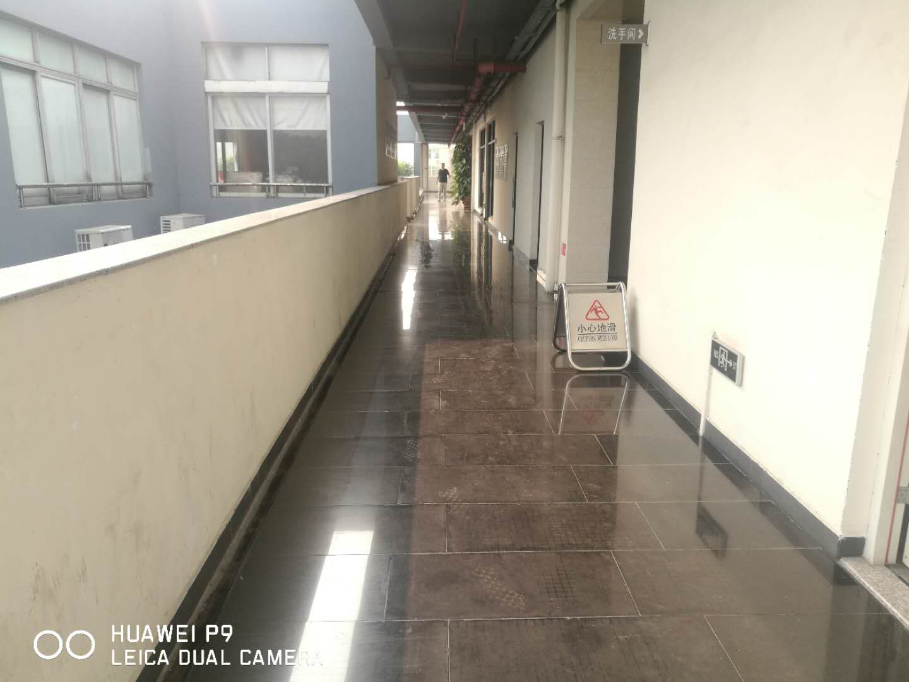
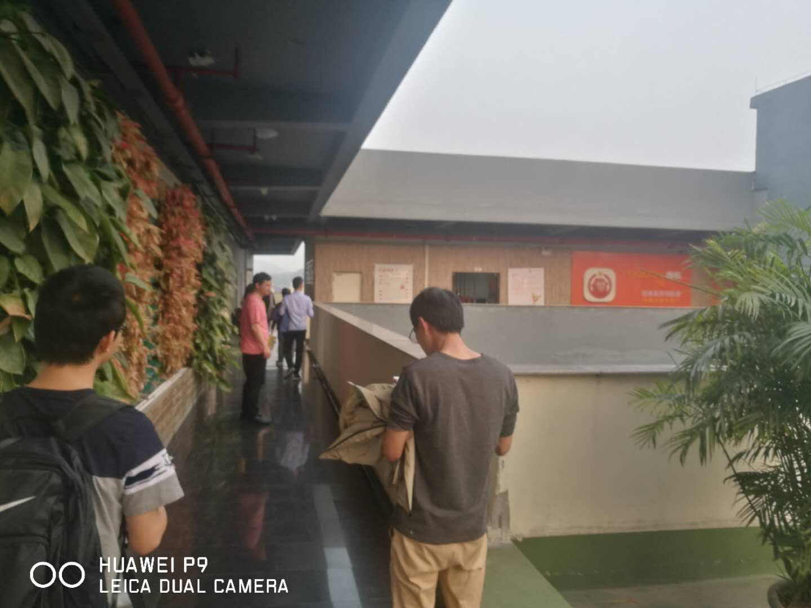
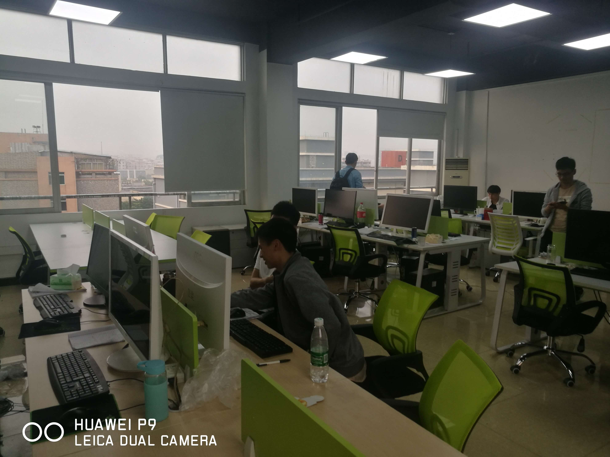
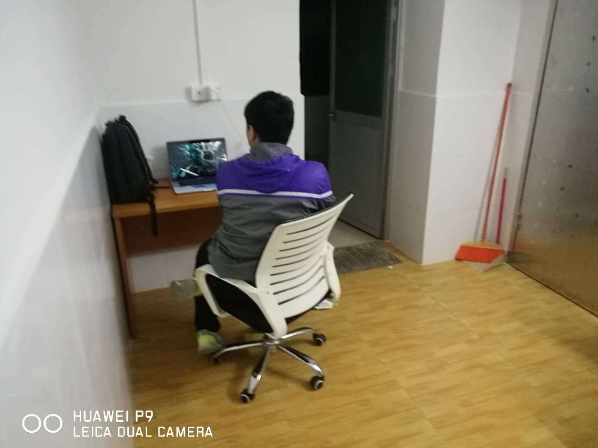
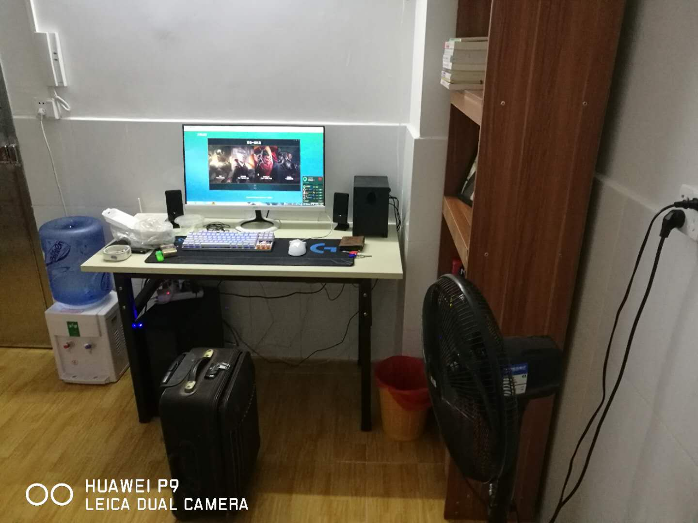
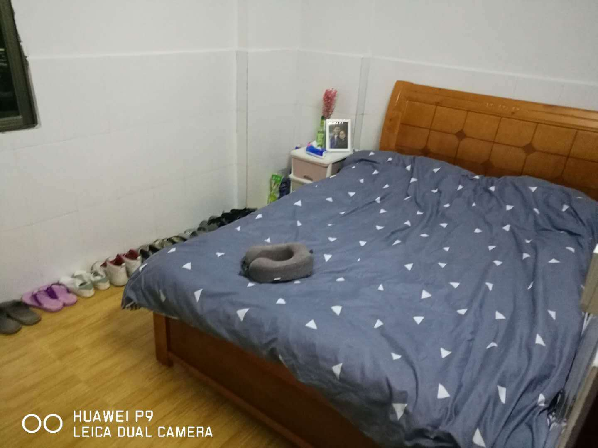
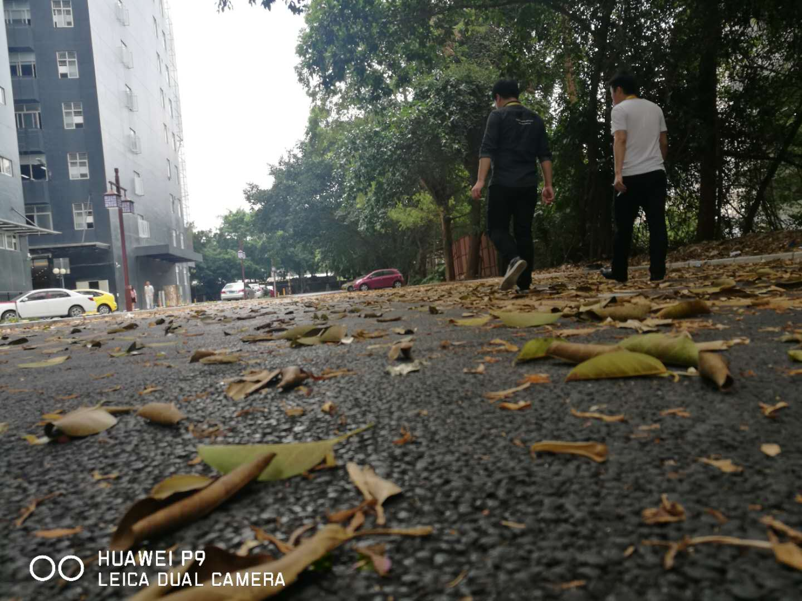
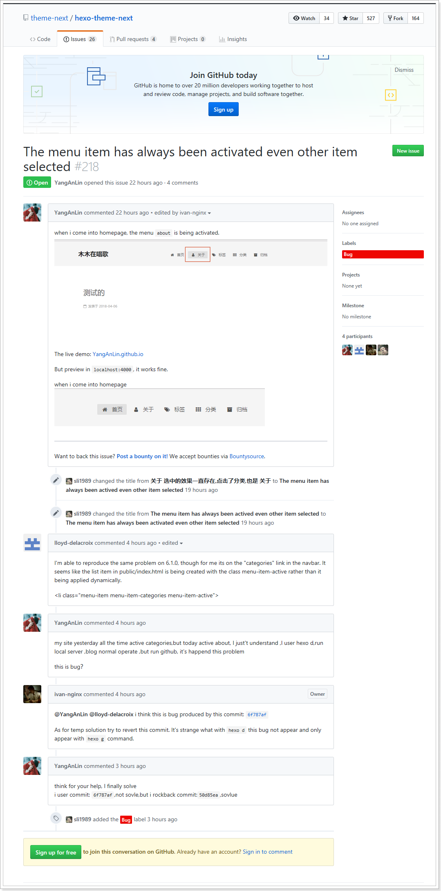

应该是03.05那天辞职的,这天是星期一,本来是想着,交接一个星期,然后12号就能在深圳这家公司来上班了,谁知道,熊司机不肯让我走,主要是还没有招到人 ,然后我走了就没有接我的锅了,所以又拖了一个星期才能离职,那个星期也是有点累,恰好那个星期招来了一个新人,刚好我跟他交接,为了我能顺利的离职,所以就每天跟他讲代码,讲业务,貌似是除了星期一的时候,我就让他一个人先看看项目代码,大概知道写的都是些什么,从星期二开始跟交接的人交接代码,每个业务的每个方法都过一遍,是真的有点累,虽然不是那么有压力,但是心里就很忐忑,万一这个星期过了,还不让走怎么走,我都跟新公司在面试定下来的时间还拖了一个星期,万一不让走,还得拖,感觉再拖的话,新公司都不想要我了,而且我已经提出离职了,留下来也没有什么意思

不过还好,公司让我走了,跟我一块走的有四个人,16号这天星期五,我就跟另外蒋文杰一起离职了,另外的两个,也都在我两离职之前的几天离职,17,18号就在深圳找房子

也没有怎么找,一共就看了三个方法,定的是第二个,有点不太好找,贵不说,主要是没有房子招租的了,我找的这套方法,上午就看了,主要是贵了,犹豫了下,想着下午找不到房子的时候,再来租,谁知道,下午就看了一间房子,也是因为没有找到招租的,所以只能看了一间房子,还是个楼梯房,只是里面的布局,我真是怀疑那些建房子做布局的时候都是吃屎的吗,怎么说也是十几层的房子,简直那房子就是推起来的,都没有一整块墙是平的,总有地方 是房间承重的东西凸起来,简直本来很好的房子,弄成了那么丑

现在租的房子是新房子,1800块一个月,还好,离公司就1.5公里,走20分钟就到了,刚到公司的还好,还是比较凉快的时间,上班走过去有出汗,但是不明显,基本上还是属于凉快点的,不过现在就有点受不了了,现在早上的太阳就变得很大,走到公司的时候已经有出汗了,而且还是气喘吁吁的

19号来这公司的,在这里一直在加班,虽然领导也没有易上云的领导那么恶心,不过这公司的项目就相当于一个OA,过段时间外包就要走了,这项目就要做的七七八八了,我就很担心把项目做完了,会不会炒掉一部分人，也所以这些天就有两次面试,而且两次面试都过了,有个面试,底层的东西都没有问,还有个面试,从框架到源码,再到底层,然后说要开20k,然后没有答应,人事开的18k,还没有决定要不要去,这家公司再菲律宾

这些天在弄博客,弄的还是很好看的,可能这次真的有花时间去弄,安装了第三方的主题,然后这个主题是有bug的,在自己电脑上运行,就挺正常的,可以一上传到github上运行,样式几改变了,然后在github 的issue上面去提问题,还用的是潦草的英语,回答问题.....一开始提的问题是用中文写的,然后有个人就帮我转成的英文,然后就有人回复了,还有个主题的开发者也回复我了,当时我就特别的感动,就很想把英语给学好,晚上睡不着,起床就再听《走遍美国》的第一节,发现我以前还听过,那个时候还在YiShangYun.Company,那还是在走路上班的时候,要走40分钟才能到公司,这过程就很无聊了,然后就听走遍美国

后来再去看的时候,已经把这个问题,做为bug了