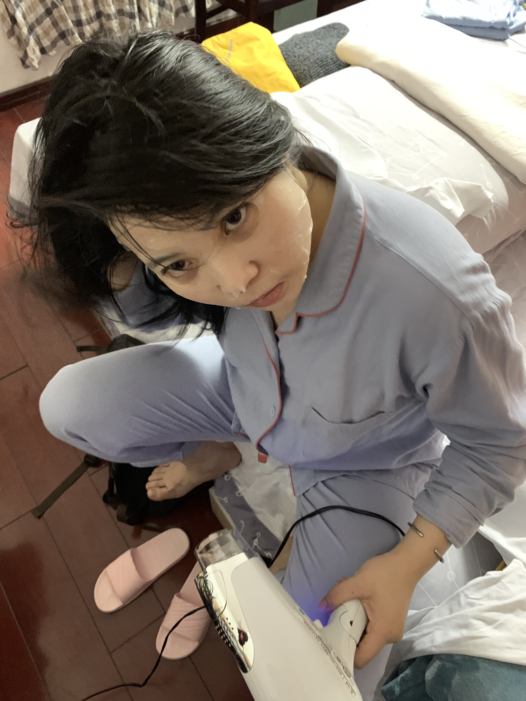
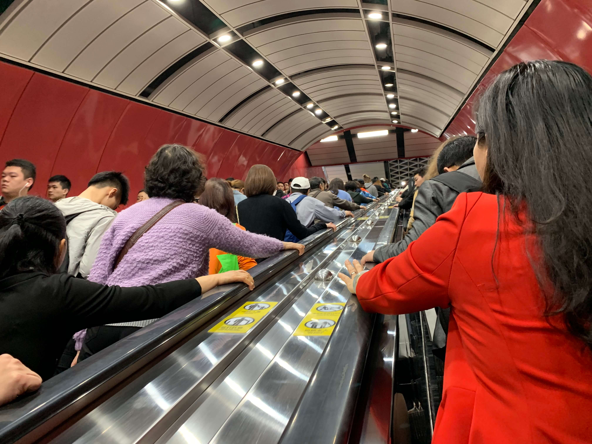
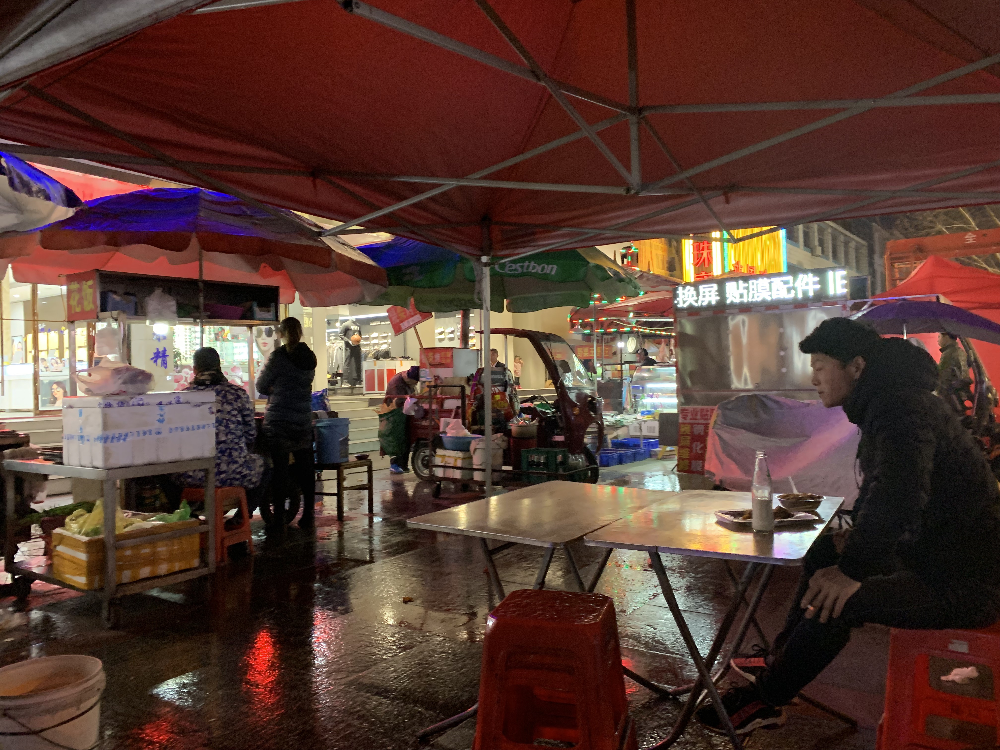
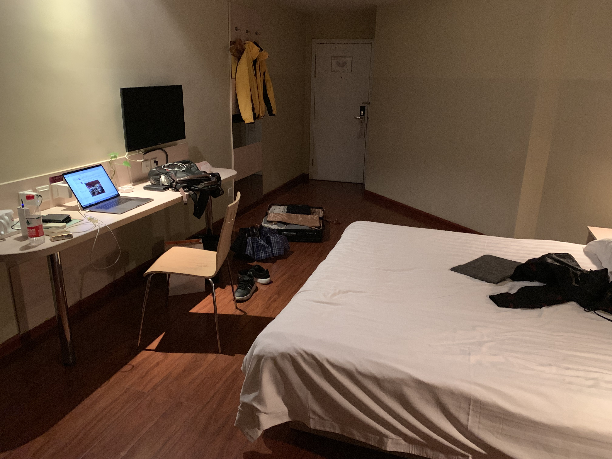

坐了一天高铁,从广州到武汉,再从武汉坐地铁到武昌,再从武昌到随州

早上起床还在黄鑫的床上,晚上就自随州的酒店里了,还是老样子,不习惯这种像时空穿越了一样

一个人在广州的地铁站里跑,去年和前年的时候,一点都不习惯在地铁里,特别上这样在电梯上看着相反的人,那时候一直想偶遇到黄鑫,虽然想偶遇,但是也不想偶遇,虽然不想偶遇,但是也非常想偶遇.

想偶遇,是因为我真的很想念黄鑫,不想偶遇,是怕见到了也不知道要说什么的尴尬,不过现在好了,不用担心在地铁上以前的那种心情,现在黄鑫已经是我女朋友了,现在在地铁上遇到还真的是件很好玩的事情

6点多到的随州,以前经常看到艳阳天的酒店,可能是因为以前没有太多钱的原因,觉得艳阳天酒店一直都是很有钱的人住的地方,在回随州的地铁上在飞猪上搜索的,才一百多块钱,哈哈哈,突然这个酒店也不是那么高大上了,我也能住得起,或许是我也开始变得有钱了

回到艳阳天的酒店,放下行李,就出来玩了,这时随州的天还是有点冷的,16°c 左右吧,路上的行人还是穿着羽绒服的,首先就在外边解放路吃了类似烧烤的东西,已经半熟的东西,在油锅里煮下,然后抹上辣椒,就变得很好吃,以前住广州黄村的时候经常吃,这次回国,在广州也没有机会吃到,在这里吃也算是回味下

一个人吃,随便点了点烧烤,还有一瓶啤酒,可能是一天都没有吃饭了,一瓶酒竟然一会就喝完了,也没有觉得特别饱肚子,事物也吃饭了,再然后就去稻草人买了个钱包,然后又在Adidas折扣店买了双鞋子,就这两样花了一千块钱

都弄完了,在酒店附近的网吧里上网,玩了差不多6个小时LOL,玩完就回来了,还是觉得我现在的生活里也应该有网吧,坐在网吧电脑前,看着启动的游戏,时光匆匆,2018年初的时候,还没有去深圳升学的时候,我还经常在家里玩游戏呢,时间一晃,自从去了乐赢之后,就没有机会去网吧玩游戏了,其实也不是特别想玩游戏吧,这是网吧这地方,满满的都是我的青春,在年少的时候,任何时间,任何学校,都有在网吧的经历,包括在各种时候出门旅游,还偶尔去别的城市的网吧里休息下