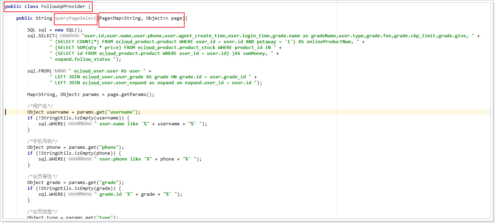

3. Mapping层用Provider这种方式

   1.一定要注意type的类名.class 和 method方法名,还要注意形参也得是一样的

   2.Provider的方法,大概就三个方法sql.SELECT,sql.WHERE,sql.FROM

   3.SQL 对象里的方法名跟别的不一样,小写的不行,idea也识别不到,要用大写,比如SLELECT

   4.Provider里返回的是String





**4.动态SQL** 

　  **1.对应关系如下**

@Insert ：@InsertProvider

@Select ：@SelectProvider

@Update ：@UpdateProvider

@Delete ：@DeleteProvider

**2.四个provider注解标识 使用了动态SQL, 使用语法格式 ：** 

```java
@UpdateProvider(type = UserProvider.class, method = "updateSQL")
```


