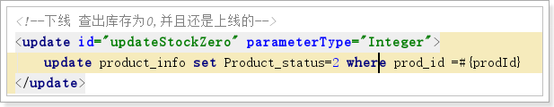
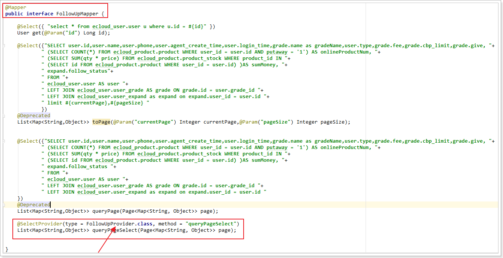
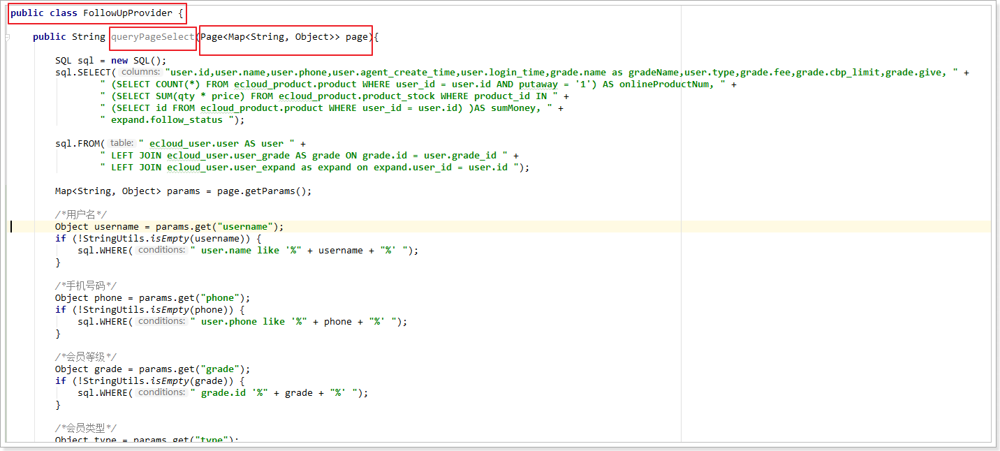

1.一张表是一个对象,如果插入的是对象,有的属性没有赋值,update了之后,相应的字段就会变成null

所以要写成这样的方式


2.如果需要更新的是两个字段,如果两个字段分别是Integer 和 String 就不要写parametype 因为在mapper接口里已经写好了




3.要注意Mapper层需要@Mapper注解

4.Provider的使用

​	1.一定要注意type的类名.class 和 method方法名,还要注意形参也得是一样的

​	2.Provider的方法,大概就三个方法sql.SELECT,sql.WHERE,sql.FROM

​	3.SQL 对象里的方法名跟别的不一样,小写的不行,idea也识别不到,要用大写,比如SLELECT

​	4.Provider里返回的是String






5.动态SQL

@Insert ：@InsertProvider

@Select ：@SelectProvider

@Update ：@UpdateProvider

@Delete ：@DeleteProvider


四个provider注解标识 使用了动态SQL, 使用语法格式 ：

```java
@UpdateProvider(type = UserProvider.class, method = "updateSQL")
```


6.mybatis特殊符号处理

1.mybatis中，使用到大于号，小于号，所以就在SQL中直接使用了

```sql
SELECT
    *
FROM
    test
WHERE
    1 = 1
AND start_date <= CURRENT_DATE
AND end_date >= CURRENT_DATE
```

2.可是，在执行时，总报错误

```tex
Error creating document instance.  Cause: org.xml.sax.SAXParseException; lineNumber: 74; columnNumber: 17; 元素内容必须由格式正确的字符数据或标记组成。
```

3.符号换成这样,就可以

```sql
SELECT * FROM test WHERE 1 = 1 AND start_date  &lt;= CURRENT_DATE AND end_date &gt;= CURRENT_DATE
```
4.XML转义字符
| &lt;   | <    | 小于号 |
| ------ | ---- | ------ |
| &gt;   | >    | 大于号 |
| &amp;  | &    | 和     |
| &apos; | ’    | 单引号 |
| &quot; | "    | 双引号 |