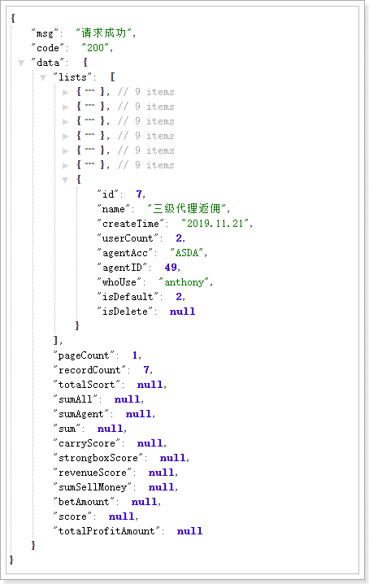

# 1.返佣方案配置列表

http://localhost:8104/agentUsers/rebateConfig?pageSize=10&pageIndex=1&agentId=12

```xml
id:编辑操作用的
name:方案名称
createTime:创建时间
userCount:使用代理
agentAcc:创建者
agentID:后面用
whoUser:所属角色
idDefault:是否是默认,1:是默认,2:不是默认(默认就没有删除按钮)
isThree 是否是下级代理:蓝色图标,没有就没有,就有删除按钮,有就渲染文本,而且没有删除按钮
```



```sql
SELECT
	rebate.ID,
	rebate.Name,
	rebate.CreateTime,
	rebate.UserCount,
	agent.AgentAcc,
	agent.AgentID,
	rebate.WhoUse,
	rebate.IsDefault
FROM
	Rebate rebate
	LEFT JOIN RebateDetail detail ON rebate.id = detail.RebateID
	LEFT JOIN T_Acc_Agent agent ON agent.AgentID = rebate.AgentID
	WHERE rebate.AgentId in(SELECT AgentID FROM T_Acc_Agent WHERE AgentID =12 OR ParentID =12 OR AgentID IN
	(SELECT AgentID FROM T_Acc_Agent WHERE ParentID in (SELECT AgentID FROM T_Acc_Agent WHERE ParentID =12)))
	ORDER BY rebate.AgentID asc
```

# **2.获取单个配置(编辑和详情,都访问这个接口)**

http://localhost:8104/agentUsers/rebateConfig?pageSize=10&pageIndex=1&agentId=12

```json
id : rebateId
rebateChoose : 1:默认返佣配置,2:负盈利返佣配置
condition：有效投注条件设定
money： 有效投注额度
rebateTime：1：一天统计一次，7，一周统计一次，30，一个月统计一次
object：[{  rebateChoose 会用到这个数据
    sumMoney:负盈利打码量
    otherRate：其他费用
    top：上线
    backRate：返水比例
    discountRate：优惠比例
    validNum：有效投注人数
    details：表格中的数据
}]
kindes：类型
types：平台
agents：[{  用来做用户筛选的
    agentId：代理ID
    agentAcc:代理名字
}]
```

